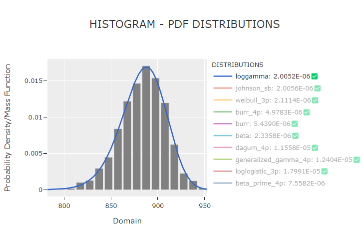
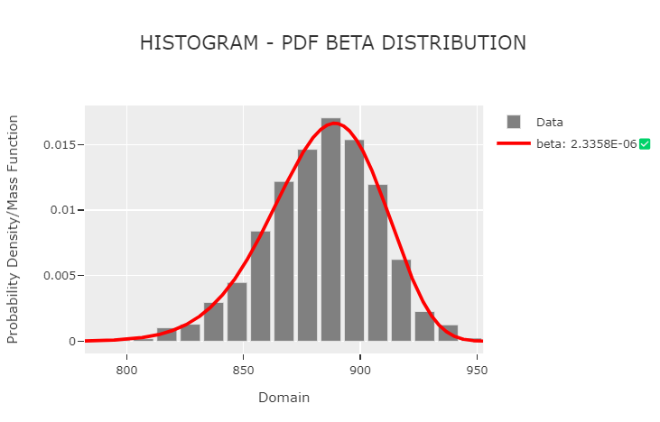
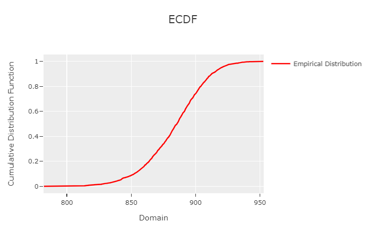
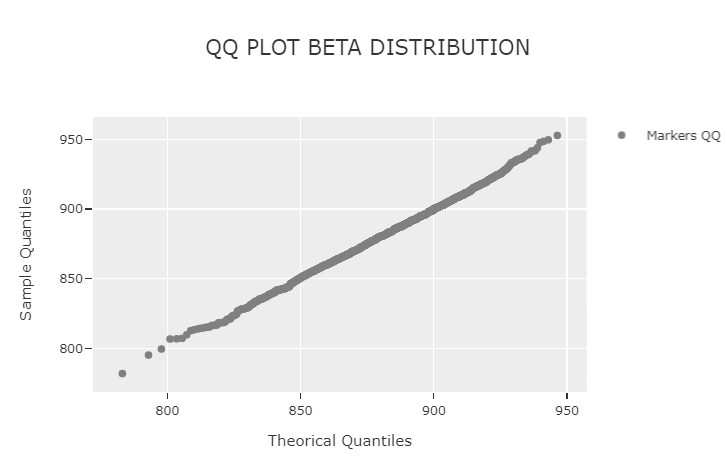
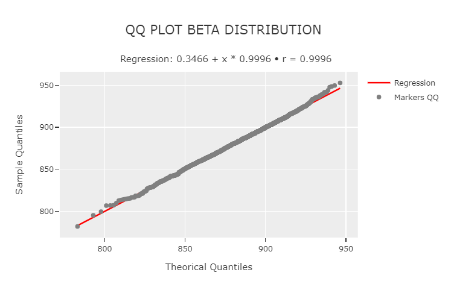

<div>
    <div style="width: 400px; margin: auto;">
        <style>
        @media (prefers-color-scheme: light) {
            .dark-logo {
                display: none;
            }
        }
        @media (prefers-color-scheme: dark) {
            .light-logo {
                display: none;
            }
        }
        </style>
        <svg viewBox="0 0 526 107" fill="none" xmlns="http://www.w3.org/2000/svg">
            <path
                class="dark-logo"
                fill-rule="evenodd"
                clip-rule="evenodd"
                d="M1 99C1 102.866 4.13401 106 8 106H21.6013V71C21.6013 68.2386 23.8399 66 26.6013 66H37.804C44.1407 66 49.9268 63.6424 54.333 59.7565C54.9029 59.254 55.4496 58.7258 55.9715 58.1739C56.0004 58.1433 56.0293 58.1127 56.058 58.082C56.0836 58.0547 56.109 58.0274 56.1344 58C56.7249 57.3636 57.2827 56.6964 57.805 56.001C60.944 51.8226 62.804 46.6285 62.804 41V31C62.804 17.1929 51.6111 6 37.804 6H1V99ZM34.7027 46H21.6013V31C21.6013 28.2386 23.8399 26 26.6013 26H34.7027C38.8448 26 42.2027 29.3579 42.2027 33.5V38.5C42.2027 39.2577 42.0903 39.9892 41.8813 40.6787C40.9479 43.7583 38.0871 46 34.7027 46Z"
                fill="#313131"
                fill-opacity="0.79"
            />
            <path
                class="dark-logo"
                d="M115.203 41C115.203 43.7614 112.964 46 110.203 46H94.6013V6H74V99C74 102.866 77.134 106 81 106H94.6013V71C94.6013 68.2386 96.8399 66 99.6013 66H108.203C112.069 66 115.203 69.134 115.203 73V99C115.203 102.866 118.337 106 122.203 106H135.804V6H115.203V41Z"
                fill="#313131"
                fill-opacity="0.79"
            />
            <path
                class="dark-logo"
                d="M151 19C151 22.866 154.134 26 158 26H164.601C168.467 26 171.601 29.134 171.601 33V81C171.601 83.7614 169.363 86 166.601 86H151V99C151 102.866 154.134 106 158 106H212.804V86H192.203V31C192.203 28.2386 194.441 26 197.203 26H212.804V6H151V19Z"
                fill="#313131"
                fill-opacity="0.79"
            />
            <path
                class="dark-logo"
                d="M228 19C228 22.866 231.134 26 235 26H241.601C245.467 26 248.601 29.134 248.601 33V99C248.601 102.866 251.735 106 255.601 106H269.203V31C269.203 28.2386 271.441 26 274.203 26H289.804V6H228V19Z"
                fill="#313131"
                fill-opacity="0.79"
            />
            <path
                class="dark-logo"
                d="M305 19C305 22.866 308.134 26 312 26H318.601C322.467 26 325.601 29.134 325.601 33V99C325.601 102.866 328.735 106 332.601 106H346.203V31C346.203 28.2386 348.441 26 351.203 26H366.804V6H305V19Z"
                fill="#313131"
                fill-opacity="0.79"
            />
            <path
                class="dark-logo"
                d="M427.048 46H402.601V31C402.601 28.2386 404.84 26 407.601 26H443.804V6H382V99C382 102.866 385.134 106 389 106H443.804V86H402.601V71C402.601 68.2386 404.84 66 407.601 66H427.048V46Z"
                fill="#313131"
                fill-opacity="0.79"
            />
            <path
                class="dark-logo"
                fill-rule="evenodd"
                clip-rule="evenodd"
                d="M459 99C459 102.866 462.134 106 466 106H478.314V68.9415C478.314 67.317 479.631 66 481.255 66H482.731C482.981 66 483.209 66.1461 483.314 66.374L499.618 101.919C500.759 104.406 503.244 106 505.981 106H520.804L501.007 63.788C503.03 63.0165 505.036 62.0082 506.909 60.7101C508.959 59.2893 510.851 57.5215 512.432 55.3373C515.682 50.8494 517.622 44.6038 516.941 36V31C516.941 17.1929 505.748 6 491.941 6H459V99ZM490.128 46H478.314V31C478.314 28.2386 480.552 26 483.314 26H490.128C494.27 26 497.628 29.3579 497.628 33.5V38.5C497.628 39.2577 497.515 39.9892 497.306 40.6787C496.373 43.7583 493.512 46 490.128 46Z"
                fill="#313131"
                fill-opacity="0.79"
            />
            <path
                class="dark-logo"
                d="M151 86H166.601C169.363 86 171.601 83.7614 171.601 81V81M151 86V99C151 102.866 154.134 106 158 106H212.804M151 86L153.95 83.0503C155.263 81.7375 157.043 81 158.899 81H171.601M192.203 86H212.804M192.203 86V31C192.203 28.2386 194.441 26 197.203 26V26M192.203 86L197.203 81M212.804 86V106M212.804 86L217.804 81M151 6V19C151 22.866 154.134 26 158 26H164.601C168.467 26 171.601 29.134 171.601 33V81M151 6H212.804M151 6L153.95 3.05025C155.263 1.7375 157.043 1 158.899 1H217.804M212.804 6V26M212.804 6L217.804 1M212.804 26L215.754 23.0503C217.067 21.7375 217.804 19.957 217.804 18.1005V1M212.804 26H197.203M212.804 106L215.754 103.05C217.067 101.737 217.804 99.957 217.804 98.1005V81M197.203 81H217.804M197.203 81V26M269.203 106H255.601C251.735 106 248.601 102.866 248.601 99V33C248.601 29.134 245.467 26 241.601 26H235C231.134 26 228 22.866 228 19V6M269.203 106V31C269.203 28.2386 271.441 26 274.203 26V26M269.203 106L272.152 103.05C273.465 101.737 274.203 99.957 274.203 98.1005V26M228 6H289.804M228 6L230.95 3.05025C232.263 1.7375 234.043 1 235.899 1H294.804M289.804 6V26M289.804 6L294.804 1M289.804 26H274.203M289.804 26L292.754 23.0503C294.067 21.7375 294.804 19.957 294.804 18.1005V1M346.203 106H332.601C328.735 106 325.601 102.866 325.601 99V33C325.601 29.134 322.467 26 318.601 26H312C308.134 26 305 22.866 305 19V6M346.203 106V31C346.203 28.2386 348.441 26 351.203 26V26M346.203 106L349.152 103.05C350.465 101.737 351.203 99.957 351.203 98.1005V26M305 6H366.804M305 6L307.95 3.05025C309.263 1.7375 311.043 1 312.899 1H371.804M366.804 6V26M366.804 6L371.804 1M366.804 26H351.203M366.804 26L369.754 23.0503C371.067 21.7375 371.804 19.957 371.804 18.1005V1M402.601 46H427.048M402.601 46V31C402.601 28.2386 404.84 26 407.601 26V26M402.601 46L407.601 41M427.048 46V66M427.048 46L432.048 41M402.601 86V71C402.601 68.2386 404.84 66 407.601 66V66M402.601 86H443.804M402.601 86L407.601 81M427.048 66H407.601M427.048 66L429.998 63.0503C431.311 61.7375 432.048 59.957 432.048 58.1005V41M443.804 6V26M443.804 6H382M443.804 6L448.804 1M443.804 26H407.601M443.804 26L446.754 23.0503C448.067 21.7375 448.804 19.957 448.804 18.1005V1M443.804 86V106M443.804 86L448.804 81M443.804 106H389C385.134 106 382 102.866 382 99V6M443.804 106L446.754 103.05C448.067 101.737 448.804 99.957 448.804 98.1005V81M407.601 41H432.048M407.601 41V26M448.804 1H389.899C388.043 1 386.263 1.7375 384.95 3.05025L382 6M448.804 81H407.601M407.601 81V66M94.6013 46H110.203C112.964 46 115.203 43.7614 115.203 41V41M94.6013 46V6M94.6013 46L99.6013 41M94.6013 106H81C77.134 106 74 102.866 74 99V6M94.6013 106V71C94.6013 68.2386 96.8399 66 99.6013 66V66M94.6013 106L97.5511 103.05C98.8638 101.737 99.6013 99.957 99.6013 98.1005V66M135.804 106H122.203C118.337 106 115.203 102.866 115.203 99V73C115.203 69.134 112.069 66 108.203 66H99.6013M135.804 106V6M135.804 106L138.754 103.05C140.067 101.737 140.804 99.957 140.804 98.1005V1M74 6H94.6013M74 6L76.9497 3.05025C78.2625 1.7375 80.043 1 81.8995 1H99.6013M94.6013 6L99.6013 1M115.203 6H135.804M115.203 6L118.152 3.05025C119.465 1.7375 121.246 1 123.102 1H140.804M115.203 6V41M135.804 6L140.804 1M99.6013 1V41M99.6013 41H115.203M21.6013 46H34.7027C38.0871 46 40.9479 43.7583 41.8813 40.6787M21.6013 46V31C21.6013 28.2386 23.8399 26 26.6013 26V26M21.6013 46L26.6013 41M21.6013 106H8C4.13401 106 1 102.866 1 99V6M21.6013 106V71C21.6013 68.2386 23.8399 66 26.6013 66V66M21.6013 106L24.5511 103.05C25.8638 101.737 26.6013 99.957 26.6013 98.1005V66M1 6H37.804C51.6111 6 62.804 17.1929 62.804 31V41C62.804 46.6285 60.944 51.8226 57.805 56.001M1 6L3.94975 3.05025C5.2625 1.7375 7.04298 1 8.89949 1H42.804C56.6111 1 67.804 12.1929 67.804 26V36C67.804 41.1997 66.7166 46.5 63.9999 50.5L61.9001 53.0197C61.6338 53.3393 61.3396 53.6345 61.0208 53.9018L56.1344 58M26.6013 41H39.7027C40.4604 41 41.1919 40.8876 41.8813 40.6787M26.6013 41V26M26.6013 66H37.804C44.1407 66 49.9268 63.6424 54.333 59.7565M26.6013 26H34.7027C38.8448 26 42.2027 29.3579 42.2027 33.5V38.5C42.2027 39.2577 42.0903 39.9892 41.8813 40.6787M57.805 56.001C57.2827 56.6964 56.7249 57.3636 56.1344 58M57.805 56.001C57.2602 56.7263 56.6769 57.421 56.058 58.082M56.1344 58C56.109 58.0274 56.0836 58.0547 56.058 58.082M54.333 59.7565C54.9029 59.254 55.4496 58.7258 55.9715 58.1739C56.0004 58.1433 56.0293 58.1127 56.058 58.082M54.333 59.7565C54.9344 59.2261 55.5101 58.6672 56.058 58.082M478.314 46H490.128C493.512 46 496.373 43.7583 497.306 40.6787M478.314 46V31C478.314 28.2386 480.552 26 483.314 26V26M478.314 46L483.314 41M478.314 106H466C462.134 106 459 102.866 459 99V6M478.314 106V68.9415C478.314 67.317 479.631 66 481.255 66H482.731C482.981 66 483.209 66.1461 483.314 66.374V66.374M478.314 106L481.264 103.05C482.576 101.737 483.314 99.957 483.314 98.1005V66.374M520.804 106H505.981C503.244 106 500.759 104.406 499.618 101.919L483.314 66.374M520.804 106L501.007 63.788M520.804 106L522.33 104.474C524.415 102.389 524.97 99.2214 523.718 96.552L506.909 60.7101M501.007 63.788C500.924 63.82 500.84 63.8515 500.756 63.8827M501.007 63.788C503.03 63.0165 505.036 62.0082 506.909 60.7101M483.314 41H495.128C495.885 41 496.617 40.8876 497.306 40.6787M483.314 41V26M459 6H491.941C505.748 6 516.941 17.1929 516.941 31V36C517.622 44.6038 515.682 50.8494 512.432 55.3373M459 6L461.95 3.05025C463.263 1.7375 465.043 1 466.899 1H496.941C510.748 1 521.941 12.1929 521.941 26V31C522.58 39.0726 520.69 45.3814 517.78 49.8217C517.553 50.1683 517.285 50.4847 516.992 50.7777L512.432 55.3373M483.314 26H490.128C494.27 26 497.628 29.3579 497.628 33.5V38.5C497.628 39.2577 497.515 39.9892 497.306 40.6787M506.909 60.7101C508.959 59.2893 510.851 57.5215 512.432 55.3373"
                stroke="#B7B7B7"
                stroke-width="2"
            />
            <path
                class="light-logo"
                fill-rule="evenodd"
                clip-rule="evenodd"
                d="M1 99C1 102.866 4.13401 106 8 106H21.6013V71C21.6013 68.2386 23.8399 66 26.6013 66H37.804C44.1407 66 49.9268 63.6424 54.333 59.7565C54.9029 59.254 55.4496 58.7258 55.9715 58.1739C56.0004 58.1433 56.0293 58.1127 56.058 58.082C56.0836 58.0547 56.109 58.0274 56.1344 58C56.7249 57.3636 57.2827 56.6964 57.805 56.001C60.944 51.8226 62.804 46.6285 62.804 41V31C62.804 17.1929 51.6111 6 37.804 6H1V99ZM34.7027 46H21.6013V31C21.6013 28.2386 23.8399 26 26.6013 26H34.7027C38.8448 26 42.2027 29.3579 42.2027 33.5V38.5C42.2027 39.2577 42.0903 39.9892 41.8813 40.6787C40.9479 43.7583 38.0871 46 34.7027 46Z"
                fill="black"
            />
            <path
                class="light-logo"
                d="M115.203 41C115.203 43.7614 112.964 46 110.203 46H94.6013V6H74V99C74 102.866 77.134 106 81 106H94.6013V71C94.6013 68.2386 96.8399 66 99.6013 66H108.203C112.069 66 115.203 69.134 115.203 73V99C115.203 102.866 118.337 106 122.203 106H135.804V6H115.203V41Z"
                fill="black"
            />
            <path
                class="light-logo"
                d="M151 19C151 22.866 154.134 26 158 26H164.601C168.467 26 171.601 29.134 171.601 33V81C171.601 83.7614 169.363 86 166.601 86H151V99C151 102.866 154.134 106 158 106H212.804V86H192.203V31C192.203 28.2386 194.441 26 197.203 26H212.804V6H151V19Z"
                fill="black"
            />
            <path
                class="light-logo"
                d="M228 19C228 22.866 231.134 26 235 26H241.601C245.467 26 248.601 29.134 248.601 33V99C248.601 102.866 251.735 106 255.601 106H269.203V31C269.203 28.2386 271.441 26 274.203 26H289.804V6H228V19Z"
                fill="black"
            />
            <path
                class="light-logo"
                d="M305 19C305 22.866 308.134 26 312 26H318.601C322.467 26 325.601 29.134 325.601 33V99C325.601 102.866 328.735 106 332.601 106H346.203V31C346.203 28.2386 348.441 26 351.203 26H366.804V6H305V19Z"
                fill="black"
            />
            <path
                class="light-logo"
                d="M427.048 46H402.601V31C402.601 28.2386 404.84 26 407.601 26H443.804V6H382V99C382 102.866 385.134 106 389 106H443.804V86H402.601V71C402.601 68.2386 404.84 66 407.601 66H427.048V46Z"
                fill="black"
            />
            <path
                class="light-logo"
                fill-rule="evenodd"
                clip-rule="evenodd"
                d="M459 99C459 102.866 462.134 106 466 106H478.314V68.9415C478.314 67.317 479.631 66 481.255 66H482.731C482.981 66 483.209 66.1461 483.314 66.374L499.618 101.919C500.759 104.406 503.244 106 505.981 106H520.804L501.007 63.788C503.03 63.0165 505.036 62.0082 506.909 60.7101C508.959 59.2893 510.851 57.5215 512.432 55.3373C515.682 50.8494 517.622 44.6038 516.941 36V31C516.941 17.1929 505.748 6 491.941 6H459V99ZM490.128 46H478.314V31C478.314 28.2386 480.552 26 483.314 26H490.128C494.27 26 497.628 29.3579 497.628 33.5V38.5C497.628 39.2577 497.515 39.9892 497.306 40.6787C496.373 43.7583 493.512 46 490.128 46Z"
                fill="black"
            />
            <path
                class="light-logo"
                d="M151 86H166.601C169.363 86 171.601 83.7614 171.601 81V81M151 86V99C151 102.866 154.134 106 158 106H212.804M151 86L153.95 83.0503C155.263 81.7375 157.043 81 158.899 81H171.601M192.203 86H212.804M192.203 86V31C192.203 28.2386 194.441 26 197.203 26V26M192.203 86L197.203 81M212.804 86V106M212.804 86L217.804 81M151 6V19C151 22.866 154.134 26 158 26H164.601C168.467 26 171.601 29.134 171.601 33V81M151 6H212.804M151 6L153.95 3.05025C155.263 1.7375 157.043 1 158.899 1H217.804M212.804 6V26M212.804 6L217.804 1M212.804 26L215.754 23.0503C217.067 21.7375 217.804 19.957 217.804 18.1005V1M212.804 26H197.203M212.804 106L215.754 103.05C217.067 101.737 217.804 99.957 217.804 98.1005V81M197.203 81H217.804M197.203 81V26M269.203 106H255.601C251.735 106 248.601 102.866 248.601 99V33C248.601 29.134 245.467 26 241.601 26H235C231.134 26 228 22.866 228 19V6M269.203 106V31C269.203 28.2386 271.441 26 274.203 26V26M269.203 106L272.152 103.05C273.465 101.737 274.203 99.957 274.203 98.1005V26M228 6H289.804M228 6L230.95 3.05025C232.263 1.7375 234.043 1 235.899 1H294.804M289.804 6V26M289.804 6L294.804 1M289.804 26H274.203M289.804 26L292.754 23.0503C294.067 21.7375 294.804 19.957 294.804 18.1005V1M346.203 106H332.601C328.735 106 325.601 102.866 325.601 99V33C325.601 29.134 322.467 26 318.601 26H312C308.134 26 305 22.866 305 19V6M346.203 106V31C346.203 28.2386 348.441 26 351.203 26V26M346.203 106L349.152 103.05C350.465 101.737 351.203 99.957 351.203 98.1005V26M305 6H366.804M305 6L307.95 3.05025C309.263 1.7375 311.043 1 312.899 1H371.804M366.804 6V26M366.804 6L371.804 1M366.804 26H351.203M366.804 26L369.754 23.0503C371.067 21.7375 371.804 19.957 371.804 18.1005V1M402.601 46H427.048M402.601 46V31C402.601 28.2386 404.84 26 407.601 26V26M402.601 46L407.601 41M427.048 46V66M427.048 46L432.048 41M402.601 86V71C402.601 68.2386 404.84 66 407.601 66V66M402.601 86H443.804M402.601 86L407.601 81M427.048 66H407.601M427.048 66L429.998 63.0503C431.311 61.7375 432.048 59.957 432.048 58.1005V41M443.804 6V26M443.804 6H382M443.804 6L448.804 1M443.804 26H407.601M443.804 26L446.754 23.0503C448.067 21.7375 448.804 19.957 448.804 18.1005V1M443.804 86V106M443.804 86L448.804 81M443.804 106H389C385.134 106 382 102.866 382 99V6M443.804 106L446.754 103.05C448.067 101.737 448.804 99.957 448.804 98.1005V81M407.601 41H432.048M407.601 41V26M448.804 1H389.899C388.043 1 386.263 1.7375 384.95 3.05025L382 6M448.804 81H407.601M407.601 81V66M94.6013 46H110.203C112.964 46 115.203 43.7614 115.203 41V41M94.6013 46V6M94.6013 46L99.6013 41M94.6013 106H81C77.134 106 74 102.866 74 99V6M94.6013 106V71C94.6013 68.2386 96.8399 66 99.6013 66V66M94.6013 106L97.5511 103.05C98.8638 101.737 99.6013 99.957 99.6013 98.1005V66M135.804 106H122.203C118.337 106 115.203 102.866 115.203 99V73C115.203 69.134 112.069 66 108.203 66H99.6013M135.804 106V6M135.804 106L138.754 103.05C140.067 101.737 140.804 99.957 140.804 98.1005V1M74 6H94.6013M74 6L76.9497 3.05025C78.2625 1.7375 80.043 1 81.8995 1H99.6013M94.6013 6L99.6013 1M115.203 6H135.804M115.203 6L118.152 3.05025C119.465 1.7375 121.246 1 123.102 1H140.804M115.203 6V41M135.804 6L140.804 1M99.6013 1V41M99.6013 41H115.203M21.6013 46H34.7027C38.0871 46 40.9479 43.7583 41.8813 40.6787M21.6013 46V31C21.6013 28.2386 23.8399 26 26.6013 26V26M21.6013 46L26.6013 41M21.6013 106H8C4.13401 106 1 102.866 1 99V6M21.6013 106V71C21.6013 68.2386 23.8399 66 26.6013 66V66M21.6013 106L24.5511 103.05C25.8638 101.737 26.6013 99.957 26.6013 98.1005V66M1 6H37.804C51.6111 6 62.804 17.1929 62.804 31V41C62.804 46.6285 60.944 51.8226 57.805 56.001M1 6L3.94975 3.05025C5.2625 1.7375 7.04298 1 8.89949 1H42.804C56.6111 1 67.804 12.1929 67.804 26V36C67.804 41.1997 66.7166 46.5 63.9999 50.5L61.9001 53.0197C61.6338 53.3393 61.3396 53.6345 61.0208 53.9018L56.1344 58M26.6013 41H39.7027C40.4604 41 41.1919 40.8876 41.8813 40.6787M26.6013 41V26M26.6013 66H37.804C44.1407 66 49.9268 63.6424 54.333 59.7565M26.6013 26H34.7027C38.8448 26 42.2027 29.3579 42.2027 33.5V38.5C42.2027 39.2577 42.0903 39.9892 41.8813 40.6787M57.805 56.001C57.2827 56.6964 56.7249 57.3636 56.1344 58M57.805 56.001C57.2602 56.7263 56.6769 57.421 56.058 58.082M56.1344 58C56.109 58.0274 56.0836 58.0547 56.058 58.082M54.333 59.7565C54.9029 59.254 55.4496 58.7258 55.9715 58.1739C56.0004 58.1433 56.0293 58.1127 56.058 58.082M54.333 59.7565C54.9344 59.2261 55.5101 58.6672 56.058 58.082M478.314 46H490.128C493.512 46 496.373 43.7583 497.306 40.6787M478.314 46V31C478.314 28.2386 480.552 26 483.314 26V26M478.314 46L483.314 41M478.314 106H466C462.134 106 459 102.866 459 99V6M478.314 106V68.9415C478.314 67.317 479.631 66 481.255 66H482.731C482.981 66 483.209 66.1461 483.314 66.374V66.374M478.314 106L481.264 103.05C482.576 101.737 483.314 99.957 483.314 98.1005V66.374M520.804 106H505.981C503.244 106 500.759 104.406 499.618 101.919L483.314 66.374M520.804 106L501.007 63.788M520.804 106L522.33 104.474C524.415 102.389 524.97 99.2214 523.718 96.552L506.909 60.7101M501.007 63.788C500.924 63.82 500.84 63.8515 500.756 63.8827M501.007 63.788C503.03 63.0165 505.036 62.0082 506.909 60.7101M483.314 41H495.128C495.885 41 496.617 40.8876 497.306 40.6787M483.314 41V26M459 6H491.941C505.748 6 516.941 17.1929 516.941 31V36C517.622 44.6038 515.682 50.8494 512.432 55.3373M459 6L461.95 3.05025C463.263 1.7375 465.043 1 466.899 1H496.941C510.748 1 521.941 12.1929 521.941 26V31C522.58 39.0726 520.69 45.3814 517.78 49.8217C517.553 50.1683 517.285 50.4847 516.992 50.7777L512.432 55.3373M483.314 26H490.128C494.27 26 497.628 29.3579 497.628 33.5V38.5C497.628 39.2577 497.515 39.9892 497.306 40.6787M506.909 60.7101C508.959 59.2893 510.851 57.5215 512.432 55.3373"
                stroke="black"
                stroke-width="2"
            />
        </svg>
    </div>
    <br>
    <p>
        Phitter analyzes datasets and determines the best analytical probability distributions that represent them. The Phitter kernel studies over 80 probability distributions, both continuous and discrete, 3 goodness-of-fit tests, and interactive visualizations. For each selected probability distribution, a standard modeling guide is provided along with spreadsheets that detail the methodology for using the chosen distribution in data science, operations research, and artificial intelligence.
    </p>
    <p>In this repository is the implementation in python and the kernel for <a src="https://phitter.io">Phitter Web</a></p>
</div>


## Installation

### Requirements
```console
python: >=3.9
```
### PyPI
```console
pip install phitter
```

## Usage

### General
```python
import phitter

data: list[int | float] = [...]

phitter_cont = phitter.PHITTER(data)
phitter_cont.fit()
```
### Full continuous  implementation
```python
import phitter

data: list[int | float] = [...]

phitter_cont = phitter.PHITTER(
    data=data,
    fit_type="continuous",
    num_bins=15,
    confidence_level=0.95,
    minimum_sse=1e-2,
    distributions_to_fit=["beta", "normal", "fatigue_life", "triangular"],
)
phitter_cont.fit(n_jobs=6)
```
### Full discrete implementation
```python
import phitter

data: list[int | float] = [...]

phitter_disc = phitter.PHITTER(
    data=data,
    fit_type="discrete",
    confidence_level=0.95,
    minimum_sse=1e-2,
    distributions_to_fit=["binomial", "geometric"],
)
phitter_disc.fit(n_jobs=2)
```

### Phitter: properties and methods
```python
import phitter
data: list[int | float] = [...]
phitter_cont = phitter.PHITTER(data)
phitter_cont.fit()

phitter_cont.best_distribution -> dict
phitter_cont.sorted_distributions_sse -> dict
phitter_cont.not_rejected_distributions -> dict
phitter_cont.df_sorted_distributions_sse -> pandas.DataFrame
phitter_cont.df_not_rejected_distributions -> pandas.DataFrame
```


### Histogram Plot
```python
import phitter
data: list[int | float] = [...]
phitter_cont = phitter.PHITTER(data)
phitter_cont.fit()

phitter_cont.plot_histogram()
```


### Histogram PDF Dsitributions Plot
```python
import phitter
data: list[int | float] = [...]
phitter_cont = phitter.PHITTER(data)
phitter_cont.fit()

phitter_cont.plot_histogram_distributions()
```


### Histogram PDF Dsitribution Plot
```python
import phitter
data: list[int | float] = [...]
phitter_cont = phitter.PHITTER(data)
phitter_cont.fit()

phitter_cont.plot_distribution("beta")
```


### ECDF Plot
```python
import phitter
data: list[int | float] = [...]
phitter_cont = phitter.PHITTER(data)
phitter_cont.fit()

phitter_cont.phitter.plot_ecdf()
```


### ECDF Distribution Plot
```python
import phitter
data: list[int | float] = [...]
phitter_cont = phitter.PHITTER(data)
phitter_cont.fit()

phitter_cont.phitter.plot_ecdf_distribution("beta")
```


### QQ Plot
```python
import phitter
data: list[int | float] = [...]
phitter_cont = phitter.PHITTER(data)
phitter_cont.fit()

phitter_cont.phitter.qq_plot("beta")
```


### QQ - Regression Plot 
```python
import phitter
data: list[int | float] = [...]
phitter_cont = phitter.PHITTER(data)
phitter_cont.fit()

phitter_cont.phitter.qq_plot_regression("beta")
```



### Distributions: Methods and properties 
```python
import phitter

distribution = phitter.continuous.BETA({"alpha": 5, "beta": 3, "A": 200, "B": 1000})

## CDF, PDF, PPF, PMF receive float or numpy.ndarray. For discrete distributions PMF instead of PDF. Parameters notation are in description of ditribution
distribution.cdf(752) # -> 0.6242831129533498
distribution.pdf(388) # -> 0.0002342575686629883
distribution.ppf(0.623) # -> 751.5512889417921
distribution.sample(2) # -> [550.800114   514.85410326]
distribution.sample(2) # -> [622.94263263 827.21838464]

## STATS
distribution.mean # -> 700.0
distribution.variance # -> 16666.666666666668
distribution.standard_deviation # -> 129.09944487358058
distribution.skewness # -> -0.3098386676965934
distribution.kurtosis # -> 2.5854545454545454
distribution.median # -> 708.707130841534
distribution.mode # -> 733.3333333333333
```

## Continuous Distributions

<div style="display: flex; flex-wrap: wrap">
    <a href="https://phitter.io/distributions/continuous/alpha" style="background-color: lightblue; color: black; padding: 2px 10px; text-decoration: none; border-radius: 5px; margin: 5px; font-weight: bolder;">ALPHA</a>
    <a href="https://phitter.io/distributions/continuous/arcsine" style="background-color: lightblue; color: black; padding: 2px 10px; text-decoration: none; border-radius: 5px; margin: 5px; font-weight: bolder;">ARCSINE</a>
    <a href="https://phitter.io/distributions/continuous/argus" style="background-color: lightblue; color: black; padding: 2px 10px; text-decoration: none; border-radius: 5px; margin: 5px; font-weight: bolder;">ARGUS</a>
    <a href="https://phitter.io/distributions/continuous/beta" style="background-color: lightblue; color: black; padding: 2px 10px; text-decoration: none; border-radius: 5px; margin: 5px; font-weight: bolder;">BETA</a>
    <a href="https://phitter.io/distributions/continuous/beta_prime" style="background-color: lightblue; color: black; padding: 2px 10px; text-decoration: none; border-radius: 5px; margin: 5px; font-weight: bolder;">BETA PRIME</a>
    <a href="https://phitter.io/distributions/continuous/beta_prime_4p" style="background-color: lightblue; color: black; padding: 2px 10px; text-decoration: none; border-radius: 5px; margin: 5px; font-weight: bolder;">BETA PRIME 4P</a>
    <a href="https://phitter.io/distributions/continuous/bradford" style="background-color: lightblue; color: black; padding: 2px 10px; text-decoration: none; border-radius: 5px; margin: 5px; font-weight: bolder;">BRADFORD</a>
    <a href="https://phitter.io/distributions/continuous/burr" style="background-color: lightblue; color: black; padding: 2px 10px; text-decoration: none; border-radius: 5px; margin: 5px; font-weight: bolder;">BURR</a>
    <a href="https://phitter.io/distributions/continuous/burr_4p" style="background-color: lightblue; color: black; padding: 2px 10px; text-decoration: none; border-radius: 5px; margin: 5px; font-weight: bolder;">BURR 4P</a>
    <a href="https://phitter.io/distributions/continuous/cauchy" style="background-color: lightblue; color: black; padding: 2px 10px; text-decoration: none; border-radius: 5px; margin: 5px; font-weight: bolder;">CAUCHY</a>
    <a href="https://phitter.io/distributions/continuous/chi_square" style="background-color: lightblue; color: black; padding: 2px 10px; text-decoration: none; border-radius: 5px; margin: 5px; font-weight: bolder;">CHI SQUARE</a>
    <a href="https://phitter.io/distributions/continuous/chi_square_3p" style="background-color: lightblue; color: black; padding: 2px 10px; text-decoration: none; border-radius: 5px; margin: 5px; font-weight: bolder;">CHI SQUARE 3P</a>
    <a href="https://phitter.io/distributions/continuous/dagum" style="background-color: lightblue; color: black; padding: 2px 10px; text-decoration: none; border-radius: 5px; margin: 5px; font-weight: bolder;">DAGUM</a>
    <a href="https://phitter.io/distributions/continuous/dagum_4p" style="background-color: lightblue; color: black; padding: 2px 10px; text-decoration: none; border-radius: 5px; margin: 5px; font-weight: bolder;">DAGUM 4P</a>
    <a href="https://phitter.io/distributions/continuous/erlang" style="background-color: lightblue; color: black; padding: 2px 10px; text-decoration: none; border-radius: 5px; margin: 5px; font-weight: bolder;">ERLANG</a>
    <a href="https://phitter.io/distributions/continuous/erlang_3p" style="background-color: lightblue; color: black; padding: 2px 10px; text-decoration: none; border-radius: 5px; margin: 5px; font-weight: bolder;">ERLANG 3P</a>
    <a href="https://phitter.io/distributions/continuous/error_function" style="background-color: lightblue; color: black; padding: 2px 10px; text-decoration: none; border-radius: 5px; margin: 5px; font-weight: bolder;">ERROR FUNCTION</a>
    <a href="https://phitter.io/distributions/continuous/exponential" style="background-color: lightblue; color: black; padding: 2px 10px; text-decoration: none; border-radius: 5px; margin: 5px; font-weight: bolder;">EXPONENTIAL</a>
    <a href="https://phitter.io/distributions/continuous/exponential_2p" style="background-color: lightblue; color: black; padding: 2px 10px; text-decoration: none; border-radius: 5px; margin: 5px; font-weight: bolder;">EXPONENTIAL 2P</a>
    <a href="https://phitter.io/distributions/continuous/f" style="background-color: lightblue; color: black; padding: 2px 10px; text-decoration: none; border-radius: 5px; margin: 5px; font-weight: bolder;">F</a>
    <a href="https://phitter.io/distributions/continuous/fatigue_life" style="background-color: lightblue; color: black; padding: 2px 10px; text-decoration: none; border-radius: 5px; margin: 5px; font-weight: bolder;">FATIGUE LIFE</a>
    <a href="https://phitter.io/distributions/continuous/folded_normal" style="background-color: lightblue; color: black; padding: 2px 10px; text-decoration: none; border-radius: 5px; margin: 5px; font-weight: bolder;">FOLDED NORMAL</a>
    <a href="https://phitter.io/distributions/continuous/frechet" style="background-color: lightblue; color: black; padding: 2px 10px; text-decoration: none; border-radius: 5px; margin: 5px; font-weight: bolder;">FRECHET</a>
    <a href="https://phitter.io/distributions/continuous/f_4p" style="background-color: lightblue; color: black; padding: 2px 10px; text-decoration: none; border-radius: 5px; margin: 5px; font-weight: bolder;">F 4P</a>
    <a href="https://phitter.io/distributions/continuous/gamma" style="background-color: lightblue; color: black; padding: 2px 10px; text-decoration: none; border-radius: 5px; margin: 5px; font-weight: bolder;">GAMMA</a>
    <a href="https://phitter.io/distributions/continuous/gamma_3p" style="background-color: lightblue; color: black; padding: 2px 10px; text-decoration: none; border-radius: 5px; margin: 5px; font-weight: bolder;">GAMMA 3P</a>
    <a href="https://phitter.io/distributions/continuous/generalized_extreme_value" style="background-color: lightblue; color: black; padding: 2px 10px; text-decoration: none; border-radius: 5px; margin: 5px; font-weight: bolder;">GENERALIZED EXTREME VALUE</a>
    <a href="https://phitter.io/distributions/continuous/generalized_gamma" style="background-color: lightblue; color: black; padding: 2px 10px; text-decoration: none; border-radius: 5px; margin: 5px; font-weight: bolder;">GENERALIZED GAMMA</a>
    <a href="https://phitter.io/distributions/continuous/generalized_gamma_4p" style="background-color: lightblue; color: black; padding: 2px 10px; text-decoration: none; border-radius: 5px; margin: 5px; font-weight: bolder;">GENERALIZED GAMMA 4P</a>
    <a href="https://phitter.io/distributions/continuous/generalized_logistic" style="background-color: lightblue; color: black; padding: 2px 10px; text-decoration: none; border-radius: 5px; margin: 5px; font-weight: bolder;">GENERALIZED LOGISTIC</a>
    <a href="https://phitter.io/distributions/continuous/generalized_normal" style="background-color: lightblue; color: black; padding: 2px 10px; text-decoration: none; border-radius: 5px; margin: 5px; font-weight: bolder;">GENERALIZED NORMAL</a>
    <a href="https://phitter.io/distributions/continuous/generalized_pareto" style="background-color: lightblue; color: black; padding: 2px 10px; text-decoration: none; border-radius: 5px; margin: 5px; font-weight: bolder;">GENERALIZED PARETO</a>
    <a href="https://phitter.io/distributions/continuous/gibrat" style="background-color: lightblue; color: black; padding: 2px 10px; text-decoration: none; border-radius: 5px; margin: 5px; font-weight: bolder;">GIBRAT</a>
    <a href="https://phitter.io/distributions/continuous/gumbel_left" style="background-color: lightblue; color: black; padding: 2px 10px; text-decoration: none; border-radius: 5px; margin: 5px; font-weight: bolder;">GUMBEL LEFT</a>
    <a href="https://phitter.io/distributions/continuous/gumbel_right" style="background-color: lightblue; color: black; padding: 2px 10px; text-decoration: none; border-radius: 5px; margin: 5px; font-weight: bolder;">GUMBEL RIGHT</a>
    <a href="https://phitter.io/distributions/continuous/half_normal" style="background-color: lightblue; color: black; padding: 2px 10px; text-decoration: none; border-radius: 5px; margin: 5px; font-weight: bolder;">HALF NORMAL</a>
    <a href="https://phitter.io/distributions/continuous/hyperbolic_secant" style="background-color: lightblue; color: black; padding: 2px 10px; text-decoration: none; border-radius: 5px; margin: 5px; font-weight: bolder;">HYPERBOLIC SECANT</a>
    <a href="https://phitter.io/distributions/continuous/inverse_gamma" style="background-color: lightblue; color: black; padding: 2px 10px; text-decoration: none; border-radius: 5px; margin: 5px; font-weight: bolder;">INVERSE GAMMA</a>
    <a href="https://phitter.io/distributions/continuous/inverse_gamma_3p" style="background-color: lightblue; color: black; padding: 2px 10px; text-decoration: none; border-radius: 5px; margin: 5px; font-weight: bolder;">INVERSE GAMMA 3P</a>
    <a href="https://phitter.io/distributions/continuous/inverse_gaussian" style="background-color: lightblue; color: black; padding: 2px 10px; text-decoration: none; border-radius: 5px; margin: 5px; font-weight: bolder;">INVERSE GAUSSIAN</a>
    <a href="https://phitter.io/distributions/continuous/inverse_gaussian_3p" style="background-color: lightblue; color: black; padding: 2px 10px; text-decoration: none; border-radius: 5px; margin: 5px; font-weight: bolder;">INVERSE GAUSSIAN 3P</a>
    <a href="https://phitter.io/distributions/continuous/johnson_sb" style="background-color: lightblue; color: black; padding: 2px 10px; text-decoration: none; border-radius: 5px; margin: 5px; font-weight: bolder;">JOHNSON SB</a>
    <a href="https://phitter.io/distributions/continuous/johnson_su" style="background-color: lightblue; color: black; padding: 2px 10px; text-decoration: none; border-radius: 5px; margin: 5px; font-weight: bolder;">JOHNSON SU</a>
    <a href="https://phitter.io/distributions/continuous/kumaraswamy" style="background-color: lightblue; color: black; padding: 2px 10px; text-decoration: none; border-radius: 5px; margin: 5px; font-weight: bolder;">KUMARASWAMY</a>
    <a href="https://phitter.io/distributions/continuous/laplace" style="background-color: lightblue; color: black; padding: 2px 10px; text-decoration: none; border-radius: 5px; margin: 5px; font-weight: bolder;">LAPLACE</a>
    <a href="https://phitter.io/distributions/continuous/levy" style="background-color: lightblue; color: black; padding: 2px 10px; text-decoration: none; border-radius: 5px; margin: 5px; font-weight: bolder;">LEVY</a>
    <a href="https://phitter.io/distributions/continuous/loggamma" style="background-color: lightblue; color: black; padding: 2px 10px; text-decoration: none; border-radius: 5px; margin: 5px; font-weight: bolder;">LOGGAMMA</a>
    <a href="https://phitter.io/distributions/continuous/logistic" style="background-color: lightblue; color: black; padding: 2px 10px; text-decoration: none; border-radius: 5px; margin: 5px; font-weight: bolder;">LOGISTIC</a>
    <a href="https://phitter.io/distributions/continuous/loglogistic" style="background-color: lightblue; color: black; padding: 2px 10px; text-decoration: none; border-radius: 5px; margin: 5px; font-weight: bolder;">LOGLOGISTIC</a>
    <a href="https://phitter.io/distributions/continuous/loglogistic_3p" style="background-color: lightblue; color: black; padding: 2px 10px; text-decoration: none; border-radius: 5px; margin: 5px; font-weight: bolder;">LOGLOGISTIC 3P</a>
    <a href="https://phitter.io/distributions/continuous/lognormal" style="background-color: lightblue; color: black; padding: 2px 10px; text-decoration: none; border-radius: 5px; margin: 5px; font-weight: bolder;">LOGNORMAL</a>
    <a href="https://phitter.io/distributions/continuous/maxwell" style="background-color: lightblue; color: black; padding: 2px 10px; text-decoration: none; border-radius: 5px; margin: 5px; font-weight: bolder;">MAXWELL</a>
    <a href="https://phitter.io/distributions/continuous/moyal" style="background-color: lightblue; color: black; padding: 2px 10px; text-decoration: none; border-radius: 5px; margin: 5px; font-weight: bolder;">MOYAL</a>
    <a href="https://phitter.io/distributions/continuous/nakagami" style="background-color: lightblue; color: black; padding: 2px 10px; text-decoration: none; border-radius: 5px; margin: 5px; font-weight: bolder;">NAKAGAMI</a>
    <a href="https://phitter.io/distributions/continuous/non_central_chi_square" style="background-color: lightblue; color: black; padding: 2px 10px; text-decoration: none; border-radius: 5px; margin: 5px; font-weight: bolder;">NON CENTRAL CHI SQUARE</a>
    <a href="https://phitter.io/distributions/continuous/non_central_f" style="background-color: lightblue; color: black; padding: 2px 10px; text-decoration: none; border-radius: 5px; margin: 5px; font-weight: bolder;">NON CENTRAL F</a>
    <a href="https://phitter.io/distributions/continuous/non_central_t_student" style="background-color: lightblue; color: black; padding: 2px 10px; text-decoration: none; border-radius: 5px; margin: 5px; font-weight: bolder;">NON CENTRAL T STUDENT</a>
    <a href="https://phitter.io/distributions/continuous/normal" style="background-color: lightblue; color: black; padding: 2px 10px; text-decoration: none; border-radius: 5px; margin: 5px; font-weight: bolder;">NORMAL</a>
    <a href="https://phitter.io/distributions/continuous/pareto_first_kind" style="background-color: lightblue; color: black; padding: 2px 10px; text-decoration: none; border-radius: 5px; margin: 5px; font-weight: bolder;">PARETO FIRST KIND</a>
    <a href="https://phitter.io/distributions/continuous/pareto_second_kind" style="background-color: lightblue; color: black; padding: 2px 10px; text-decoration: none; border-radius: 5px; margin: 5px; font-weight: bolder;">PARETO SECOND KIND</a>
    <a href="https://phitter.io/distributions/continuous/pert" style="background-color: lightblue; color: black; padding: 2px 10px; text-decoration: none; border-radius: 5px; margin: 5px; font-weight: bolder;">PERT</a>
    <a href="https://phitter.io/distributions/continuous/power_function" style="background-color: lightblue; color: black; padding: 2px 10px; text-decoration: none; border-radius: 5px; margin: 5px; font-weight: bolder;">POWER FUNCTION</a>
    <a href="https://phitter.io/distributions/continuous/rayleigh" style="background-color: lightblue; color: black; padding: 2px 10px; text-decoration: none; border-radius: 5px; margin: 5px; font-weight: bolder;">RAYLEIGH</a>
    <a href="https://phitter.io/distributions/continuous/reciprocal" style="background-color: lightblue; color: black; padding: 2px 10px; text-decoration: none; border-radius: 5px; margin: 5px; font-weight: bolder;">RECIPROCAL</a>
    <a href="https://phitter.io/distributions/continuous/rice" style="background-color: lightblue; color: black; padding: 2px 10px; text-decoration: none; border-radius: 5px; margin: 5px; font-weight: bolder;">RICE</a>
    <a href="https://phitter.io/distributions/continuous/semicircular" style="background-color: lightblue; color: black; padding: 2px 10px; text-decoration: none; border-radius: 5px; margin: 5px; font-weight: bolder;">SEMICIRCULAR</a>
    <a href="https://phitter.io/distributions/continuous/trapezoidal" style="background-color: lightblue; color: black; padding: 2px 10px; text-decoration: none; border-radius: 5px; margin: 5px; font-weight: bolder;">TRAPEZOIDAL</a>
    <a href="https://phitter.io/distributions/continuous/triangular" style="background-color: lightblue; color: black; padding: 2px 10px; text-decoration: none; border-radius: 5px; margin: 5px; font-weight: bolder;">TRIANGULAR</a>
    <a href="https://phitter.io/distributions/continuous/t_student" style="background-color: lightblue; color: black; padding: 2px 10px; text-decoration: none; border-radius: 5px; margin: 5px; font-weight: bolder;">T STUDENT</a>
    <a href="https://phitter.io/distributions/continuous/t_student_3p" style="background-color: lightblue; color: black; padding: 2px 10px; text-decoration: none; border-radius: 5px; margin: 5px; font-weight: bolder;">T STUDENT 3P</a>
    <a href="https://phitter.io/distributions/continuous/uniform" style="background-color: lightblue; color: black; padding: 2px 10px; text-decoration: none; border-radius: 5px; margin: 5px; font-weight: bolder;">UNIFORM</a>
    <a href="https://phitter.io/distributions/continuous/weibull" style="background-color: lightblue; color: black; padding: 2px 10px; text-decoration: none; border-radius: 5px; margin: 5px; font-weight: bolder;">WEIBULL</a>
    <a href="https://phitter.io/distributions/continuous/weibull_3p" style="background-color: lightblue; color: black; padding: 2px 10px; text-decoration: none; border-radius: 5px; margin: 5px; font-weight: bolder;">WEIBULL 3P</a>

</div>

## Discrete Distributions

<div style="display: flex; flex-wrap: wrap">
    <a href="https://phitter.io/distributions/discrete/bernoulli" style="background-color: lightblue; color: black; padding: 2px 10px; text-decoration: none; border-radius: 5px; margin: 5px; font-weight: bolder;">BERNOULLI</a>
    <a href="https://phitter.io/distributions/discrete/binomial" style="background-color: lightblue; color: black; padding: 2px 10px; text-decoration: none; border-radius: 5px; margin: 5px; font-weight: bolder;">BINOMIAL</a>
    <a href="https://phitter.io/distributions/discrete/geometric" style="background-color: lightblue; color: black; padding: 2px 10px; text-decoration: none; border-radius: 5px; margin: 5px; font-weight: bolder;">GEOMETRIC</a>
    <a href="https://phitter.io/distributions/discrete/hypergeometric" style="background-color: lightblue; color: black; padding: 2px 10px; text-decoration: none; border-radius: 5px; margin: 5px; font-weight: bolder;">HYPERGEOMETRIC</a>
    <a href="https://phitter.io/distributions/discrete/logarithmic" style="background-color: lightblue; color: black; padding: 2px 10px; text-decoration: none; border-radius: 5px; margin: 5px; font-weight: bolder;">LOGARITHMIC</a>
    <a href="https://phitter.io/distributions/discrete/negative_binomial" style="background-color: lightblue; color: black; padding: 2px 10px; text-decoration: none; border-radius: 5px; margin: 5px; font-weight: bolder;">NEGATIVE BINOMIAL</a>
    <a href="https://phitter.io/distributions/discrete/poisson" style="background-color: lightblue; color: black; padding: 2px 10px; text-decoration: none; border-radius: 5px; margin: 5px; font-weight: bolder;">POISSON</a>
    <a href="https://phitter.io/distributions/discrete/uniform" style="background-color: lightblue; color: black; padding: 2px 10px; text-decoration: none; border-radius: 5px; margin: 5px; font-weight: bolder;">UNIFORM</a>
</div>

 