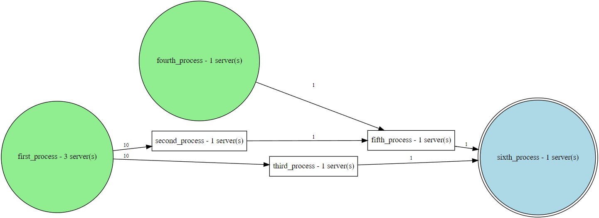

<p align="center">
    <picture>
        <source media="(prefers-color-scheme: dark)" srcset="https://gist.githubusercontent.com/phitter-core/66bc7f3674eac01ae646e30ba697a6d7/raw/e96dbba0eb26b20d35e608fefc3984bd87f0010b/DarkPhitterLogo.svg" width="350">
        <source media="(prefers-color-scheme: light)" srcset="https://gist.githubusercontent.com/phitter-core/170ce460d7e766545265772525edecf6/raw/71b4867c6e5683455cf1d68bea5bea7eda55ce7d/LightPhitterLogo.svg" width="350">
        
    </picture>
</p>

<p align="center">
    <a href="https://pypi.org/project/phitter" target="_blank">
        
    </a>
    <a href="https://pypi.org/project/phitter" target="_blank">
        
    </a>
    <a href="https://pypi.org/project/phitter" target="_blank">
        
    </a>
    <a href="https://github.com/phitter-core/phitter-kernel/actions/workflows/unittest.yml" target="_blank">
        
    </a>
</p>

<p>
    Phitter analyzes datasets and determines the best analytical probability distributions that represent them. Phitter studies over 80 probability distributions, both continuous and discrete, 3 goodness-of-fit tests, and interactive visualizations. For each selected probability distribution, a standard modeling guide is provided along with spreadsheets that detail the methodology for using the chosen distribution in data science, operations research, and artificial intelligence.
</p>

<p>
    Additionally, Phitter enables advanced process simulations, allowing to model and visualize key performance metrics such as minimum observation times. It facilitates the simulation of queuing systems with configurable parameters, including the number of servers, system capacity, maximum population size, and service discipline. Supported queuing models encompass FIFO, LIFO and PBS, ensuring adaptability to various operational and research applications.
</p>

<p>
    This repository contains the implementation of the python library and the kernel of <a href="https://phitter.io">Phitter Web</a>
</p>

## 📄 Documentation

Find the complete Phitter documentation [here](https://docs-phitter-kernel.netlify.app/).

## Installation

### Requirements

```console
python: >=3.9
```

### PyPI

```console
pip install phitter
```

## Usage

### **_1. Fit Notebook's Tutorials_**

|             Tutorial             |                                                                                                                      Notebooks                                                                                                                      |
| :------------------------------: | :-------------------------------------------------------------------------------------------------------------------------------------------------------------------------------------------------------------------------------------------------: |
|        **Fit Continuous**        |    <a target="_blank" href="https://colab.research.google.com/github/phitter-core/phitter-kernel/blob/main/examples/fit/fit_continuous_ncdb.ipynb"></a>    |
|         **Fit Discrete**         | <a target="_blank" href="https://colab.research.google.com/github/phitter-core/phitter-kernel/blob/main/examples/fit/fit_discrete_galton_board.ipynb"></a> |
| **Fit Accelerate [Sample>100K]** |      <a target="_blank" href="https://colab.research.google.com/github/phitter-core/phitter-kernel/blob/main/examples/fit/fit_accelerate.ipynb"></a>       |
|  **Fit Specific Distribution**   | <a target="_blank" href="https://colab.research.google.com/github/phitter-core/phitter-kernel/blob/main/examples/fit/fit_specific_distribution.ipynb"></a> |
|     **Working Distribution**     |   <a target="_blank" href="https://colab.research.google.com/github/phitter-core/phitter-kernel/blob/main/examples/fit/working_distribution.ipynb"></a>    |

### **_2. Simulation Notebook's Tutorials_**

|                     Tutorial                      |                                                                                                                           Notebooks                                                                                                                           |
| :-----------------------------------------------: | :-----------------------------------------------------------------------------------------------------------------------------------------------------------------------------------------------------------------------------------------------------------: |
|              **Process Simulation**               |      <a target="_blank" href="https://colab.research.google.com/github/phitter-core/phitter-kernel/blob/main/examples/simulation/process_simulation.ipynb"></a>      |
|               **Own Distribution**                | <a target="_blank" href="https://colab.research.google.com/github/phitter-core/phitter-kernel/blob/main/examples/simulation/own_distribution_explanation.ipynb"></a> |
|  **Queue Simulation First-In-First-Out (FIFO)**   |    <a target="_blank" href="https://colab.research.google.com/github/phitter-core/phitter-kernel/blob/main/examples/simulation/queue_simulation_fifo.ipynb"></a>     |
|   **Queue Simulation Last-In-First-Out (LIFO)**   |    <a target="_blank" href="https://colab.research.google.com/github/phitter-core/phitter-kernel/blob/main/examples/simulation/queue_simulation_lifo.ipynb"></a>     |
| **Queue Simulation Priority-Based Service (PBS)** |     <a target="_blank" href="https://colab.research.google.com/github/phitter-core/phitter-kernel/blob/main/examples/simulation/queue_simulation_pbs.ipynb"></a>     |

## Documentation

<details>

<summary style="font-size: 16px; font-weight: bold;">Documentation Fit Module</summary>

### General Fit

```python
import phitter

## Define your dataset
data: list[int | float] = [...]

## Make a continuous fit using Phitter
phi = phitter.Phitter(data=data)
phi.fit()
```

### Full continuous implementation

```python
import phitter

## Define your dataset
data: list[int | float] = [...]

## Make a continuous fit using Phitter
phi = phitter.Phitter(
    data=data,
    fit_type="continuous",
    num_bins=15,
    confidence_level=0.95,
    minimum_sse=1e-2,
    distributions_to_fit=["beta", "normal", "fatigue_life", "triangular"],
)
phi.fit(n_workers=6)
```

### Full discrete implementation

```python
import phitter

## Define your dataset
data: list[int | float] = [...]

## Make a discrete fit using Phitter
phi = phitter.Phitter(
    data=data,
    fit_type="discrete",
    confidence_level=0.95,
    minimum_sse=1e-2,
    distributions_to_fit=["binomial", "geometric"],
)
phi.fit(n_workers=2)
```

### Phitter: properties and methods

```python
import phitter

## Define your dataset
data: list[int | float] = [...]

## Make a fit using Phitter
phi = phitter.Phitter(data=data)
phi.fit(n_workers=2)

## Global methods and properties
phi.summarize(k: int) -> pandas.DataFrame
phi.summarize_info(k: int) -> pandas.DataFrame
phi.best_distribution -> dict
phi.sorted_distributions_sse -> dict
phi.not_rejected_distributions -> dict
phi.df_sorted_distributions_sse -> pandas.DataFrame
phi.df_not_rejected_distributions -> pandas.DataFrame

## Specific distribution methods and properties
phi.get_parameters(id_distribution: str) -> dict
phi.get_test_chi_square(id_distribution: str) -> dict
phi.get_test_kolmmogorov_smirnov(id_distribution: str) -> dict
phi.get_test_anderson_darling(id_distribution: str) -> dict
phi.get_sse(id_distribution: str) -> float
phi.get_n_test_passed(id_distribution: str) -> int
phi.get_n_test_null(id_distribution: str) -> int
```

### Histogram Plot

```python
import phitter
data: list[int | float] = [...]
phi = phitter.Phitter(data=data)
phi.fit()

phi.plot_histogram()
```


### Histogram PDF Dsitributions Plot

```python
import phitter
data: list[int | float] = [...]
phi = phitter.Phitter(data=data)
phi.fit()

phi.plot_histogram_distributions()
```


### Histogram PDF Dsitribution Plot

```python
import phitter
data: list[int | float] = [...]
phi = phitter.Phitter(data=data)
phi.fit()

phi.plot_distribution("beta")
```


### ECDF Plot

```python
import phitter
data: list[int | float] = [...]
phi = phitter.Phitter(data=data)
phi.fit()

phi.plot_ecdf()
```


### ECDF Distribution Plot

```python
import phitter
data: list[int | float] = [...]
phi = phitter.Phitter(data=data)
phi.fit()

phi.plot_ecdf_distribution("beta")
```


### QQ Plot

```python
import phitter
data: list[int | float] = [...]
phi = phitter.Phitter(data=data)
phi.fit()

phi.qq_plot("beta")
```


### QQ - Regression Plot

```python
import phitter
data: list[int | float] = [...]
phi = phitter.Phitter(data=data)
phi.fit()

phi.qq_plot_regression("beta")
```


### Working with distributions: Methods and properties

```python
import phitter

distribution = phitter.continuous.Beta({"alpha": 5, "beta": 3, "A": 200, "B": 1000})

## CDF, PDF, PPF, PMF receive float or numpy.ndarray. For discrete distributions PMF instead of PDF. Parameters notation are in description of ditribution
distribution.cdf(752) # -> 0.6242831129533498
distribution.pdf(388) # -> 0.0002342575686629883
distribution.ppf(0.623) # -> 751.5512889417921
distribution.sample(2) # -> [550.800114   514.85410326]

## STATS
distribution.mean # -> 700.0
distribution.variance # -> 16666.666666666668
distribution.standard_deviation # -> 129.09944487358058
distribution.skewness # -> -0.3098386676965934
distribution.kurtosis # -> 2.5854545454545454
distribution.median # -> 708.707130841534
distribution.mode # -> 733.3333333333333
```

## Continuous Distributions

#### [1. PDF File Documentation Continuous Distributions](https://github.com/phitter-core/phitter-kernel/blob/main/distributions_documentation/continuous/document_continuous_distributions/phitter_continuous_distributions.pdf)

#### 2. Resources Continuous Distributions

| Distribution              | Phitter Playground                                                                                     | Excel File                                                                                                                      | Google Sheets Files                                                                                                |
| :------------------------ | :----------------------------------------------------------------------------------------------------- | :------------------------------------------------------------------------------------------------------------------------------ | :----------------------------------------------------------------------------------------------------------------- |
| alpha                     | ▶️[phitter:alpha](https://phitter.io/distributions/continuous/alpha)                                   | 📊[alpha.xlsx](https://github.com/phitter-core/phitter-files/blob/main/continuous/alpha.xlsx)                                   | 🌐[gs:alpha](https://docs.google.com/spreadsheets/d/1yRovxx1YbqgEul65DjjXetysc_4qgX2a_2NQQA1AxCA)                  |
| arcsine                   | ▶️[phitter:arcsine](https://phitter.io/distributions/continuous/arcsine)                               | 📊[arcsine.xlsx](https://github.com/phitter-core/phitter-files/blob/main/continuous/arcsine.xlsx)                               | 🌐[gs:arcsine](https://docs.google.com/spreadsheets/d/1q8SKX4gmSbpGzimRvjopzaZ4KrEV5NY1EPmf1G1T7NQ)                |
| argus                     | ▶️[phitter:argus](https://phitter.io/distributions/continuous/argus)                                   | 📊[argus.xlsx](https://github.com/phitter-core/phitter-files/blob/main/continuous/argus.xlsx)                                   | 🌐[gs:argus](https://docs.google.com/spreadsheets/d/1u2x7IFUSB7rEyhs7s6-C2btT1Bk5aCr4WiUYEML-8xs)                  |
| beta                      | ▶️[phitter:beta](https://phitter.io/distributions/continuous/beta)                                     | 📊[beta.xlsx](https://github.com/phitter-core/phitter-files/blob/main/continuous/beta.xlsx)                                     | 🌐[gs:beta](https://docs.google.com/spreadsheets/d/1P7NDy-9toV3dv64gabnr8l2NjB1xt_Ani5IVMTx3gyU)                   |
| beta_prime                | ▶️[phitter:beta_prime](https://phitter.io/distributions/continuous/beta_prime)                         | 📊[beta_prime.xlsx](https://github.com/phitter-core/phitter-files/blob/main/continuous/beta_prime.xlsx)                         | 🌐[gs:beta_prime](https://docs.google.com/spreadsheets/d/1-8cKeS9D6YixQE_uLig7UarXcoQoE-341yHDj8sfXA8)             |
| beta_prime_4p             | ▶️[phitter:beta_prime_4p](https://phitter.io/distributions/continuous/beta_prime_4p)                   | 📊[beta_prime_4p.xlsx](https://github.com/phitter-core/phitter-files/blob/main/continuous/beta_prime_4p.xlsx)                   | 🌐[gs:beta_prime_4p](https://docs.google.com/spreadsheets/d/1vlaZrj_jX9oNGwjW0o4Z1AUTuUTGE8Z-Akis_wb7Jq4)          |
| bradford                  | ▶️[phitter:bradford](https://phitter.io/distributions/continuous/bradford)                             | 📊[bradford.xlsx](https://github.com/phitter-core/phitter-files/blob/main/continuous/bradford.xlsx)                             | 🌐[gs:bradford](https://docs.google.com/spreadsheets/d/1kI8b05IXur3I9SUJdrbYIdv7zMdzVxVGPWx6sK6YmuU)               |
| burr                      | ▶️[phitter:burr](https://phitter.io/distributions/continuous/burr)                                     | 📊[burr.xlsx](https://github.com/phitter-core/phitter-files/blob/main/continuous/burr.xlsx)                                     | 🌐[gs:burr](https://docs.google.com/spreadsheets/d/1vhY3l3VAgBj9BQT1yE3meRTmEZP3HXjjm30nxDKCwCI)                   |
| burr_4p                   | ▶️[phitter:burr_4p](https://phitter.io/distributions/continuous/burr_4p)                               | 📊[burr_4p.xlsx](https://github.com/phitter-core/phitter-files/blob/main/continuous/burr_4p.xlsx)                               | 🌐[gs:burr_4p](https://docs.google.com/spreadsheets/d/1tEk3O2yvANj_PlLqACuwvRSqYYGQVRFH1SPMdLGYnz4)                |
| cauchy                    | ▶️[phitter:cauchy](https://phitter.io/distributions/continuous/cauchy)                                 | 📊[cauchy.xlsx](https://github.com/phitter-core/phitter-files/blob/main/continuous/cauchy.xlsx)                                 | 🌐[gs:cauchy](https://docs.google.com/spreadsheets/d/1xoJJvuSvfg-umC7Ogio9fde1l4TiWuAlR2IxucYK0y8)                 |
| chi_square                | ▶️[phitter:chi_square](https://phitter.io/distributions/continuous/chi_square)                         | 📊[chi_square.xlsx](https://github.com/phitter-core/phitter-files/blob/main/continuous/chi_square.xlsx)                         | 🌐[gs:chi_square](https://docs.google.com/spreadsheets/d/1VatJuUON_2qghjPEYMdcjGE7TYbYqduzgdYe5YNyVf4)             |
| chi_square_3p             | ▶️[phitter:chi_square_3p](https://phitter.io/distributions/continuous/chi_square_3p)                   | 📊[chi_square_3p.xlsx](https://github.com/phitter-core/phitter-files/blob/main/continuous/chi_square_3p.xlsx)                   | 🌐[gs:chi_square_3p](https://docs.google.com/spreadsheets/d/15tf3ZKbEgR3JWQRbMT2OaNij3INTGGUuNsR01NCDFJw)          |
| dagum                     | ▶️[phitter:dagum](https://phitter.io/distributions/continuous/dagum)                                   | 📊[dagum.xlsx](https://github.com/phitter-core/phitter-files/blob/main/continuous/dagum.xlsx)                                   | 🌐[gs:dagum](https://docs.google.com/spreadsheets/d/1qct7LByxY_z2-Rl-pWFG1LQsUxW8VQaCgLizn93YPxk)                  |
| dagum_4p                  | ▶️[phitter:dagum_4p](https://phitter.io/distributions/continuous/dagum_4p)                             | 📊[dagum_4p.xlsx](https://github.com/phitter-core/phitter-files/blob/main/continuous/dagum_4p.xlsx)                             | 🌐[gs:dagum_4p](https://docs.google.com/spreadsheets/d/1ZkKqvVdy7CvhvXwK830F6GWJrdNxoXBxJYeFD6XC2DM)               |
| erlang                    | ▶️[phitter:erlang](https://phitter.io/distributions/continuous/erlang)                                 | 📊[erlang.xlsx](https://github.com/phitter-core/phitter-files/blob/main/continuous/erlang.xlsx)                                 | 🌐[gs:erlang](https://docs.google.com/spreadsheets/d/1uG3Otntnm3cvMSkhkEiBVKuFn1pCLSWmiCxfN01D824)                 |
| erlang_3p                 | ▶️[phitter:erlang_3p](https://phitter.io/distributions/continuous/erlang_3p)                           | 📊[erlang_3p.xlsx](https://github.com/phitter-core/phitter-files/blob/main/continuous/erlang_3p.xlsx)                           | 🌐[gs:erlang_3p](https://docs.google.com/spreadsheets/d/1EvFPyOAL-TPQyNf7sAXfqgHqap8sGynH0XxrLRVP12M)              |
| error_function            | ▶️[phitter:error_function](https://phitter.io/distributions/continuous/error_function)                 | 📊[error_function.xlsx](https://github.com/phitter-core/phitter-files/blob/main/continuous/error_function.xlsx)                 | 🌐[gs:error_function](https://docs.google.com/spreadsheets/d/1QT1vSgTWVgDmNz4FrH3fhwRGpgvPohgqZSCADHfBXkM)         |
| exponential               | ▶️[phitter:exponential](https://phitter.io/distributions/continuous/exponential)                       | 📊[exponential.xlsx](https://github.com/phitter-core/phitter-files/blob/main/continuous/exponential.xlsx)                       | 🌐[gs:exponential](https://docs.google.com/spreadsheets/d/1c8aCgHTq3fEyIkVM1Ph3fzebxQMuourz1UkWbH4h3HA)            |
| exponential_2p            | ▶️[phitter:exponential_2p](https://phitter.io/distributions/continuous/exponential_2p)                 | 📊[exponential_2p.xlsx](https://github.com/phitter-core/phitter-files/blob/main/continuous/exponential_2p.xlsx)                 | 🌐[gs:exponential_2p](https://docs.google.com/spreadsheets/d/1XtrdS8iSCM1l33rbaXSz1uWZ3vnQsYPK-07NYE-ZYBs)         |
| f                         | ▶️[phitter:f](https://phitter.io/distributions/continuous/f)                                           | 📊[f.xlsx](https://github.com/phitter-core/phitter-files/blob/main/continuous/f.xlsx)                                           | 🌐[gs:f](https://docs.google.com/spreadsheets/d/137gYI8B6MDnqFoQ4bY1crdpFSKtPzRgaJS564SY_CUY)                      |
| f_4p                      | ▶️[phitter:f_4p](https://phitter.io/distributions/continuous/f_4p)                                     | 📊[f_4p.xlsx](https://github.com/phitter-core/phitter-files/blob/main/continuous/f_4p.xlsx)                                     | 🌐[gs:f_4p](https://docs.google.com/spreadsheets/d/11MgyMqzOyGNtFLdGviRTeNhAQMYBCJ8QRMHGxoPCzwM)                   |
| fatigue_life              | ▶️[phitter:fatigue_life](https://phitter.io/distributions/continuous/fatigue_life)                     | 📊[fatigue_life.xlsx](https://github.com/phitter-core/phitter-files/blob/main/continuous/fatigue_life.xlsx)                     | 🌐[gs:fatigue_life](https://docs.google.com/spreadsheets/d/1j-U_YMX89VHe2jVq3pazpzqYeA1j1zopW22C9yJcPS0)           |
| folded_normal             | ▶️[phitter:folded_normal](https://phitter.io/distributions/continuous/folded_normal)                   | 📊[folded_normal.xlsx](https://github.com/phitter-core/phitter-files/blob/main/continuous/folded_normal.xlsx)                   | 🌐[gs:folded_normal](https://docs.google.com/spreadsheets/d/17NlSnru_46J8pSjxMPLDlzxoG2fPKWjeFvTh0ydfX4k)          |
| frechet                   | ▶️[phitter:frechet](https://phitter.io/distributions/continuous/frechet)                               | 📊[frechet.xlsx](https://github.com/phitter-core/phitter-files/blob/main/continuous/frechet.xlsx)                               | 🌐[gs:frechet](https://docs.google.com/spreadsheets/d/1PNGvHImwOFIragM_hHrQJcTN7OcqCKFoHKXlPq76fnI)                |
| gamma                     | ▶️[phitter:gamma](https://phitter.io/distributions/continuous/gamma)                                   | 📊[gamma.xlsx](https://github.com/phitter-core/phitter-files/blob/main/continuous/gamma.xlsx)                                   | 🌐[gs:gamma](https://docs.google.com/spreadsheets/d/1HgD3a1zOml7Hy9PMVvFwQwrbmbs8iPbH-zQMowH0LVE)                  |
| gamma_3p                  | ▶️[phitter:gamma_3p](https://phitter.io/distributions/continuous/gamma_3p)                             | 📊[gamma_3p.xlsx](https://github.com/phitter-core/phitter-files/blob/main/continuous/gamma_3p.xlsx)                             | 🌐[gs:gamma_3p](https://docs.google.com/spreadsheets/d/1NkyFZFOMzk2V9qkFEI_zhGUGWiGV-K9vU-RLaFB7ip8)               |
| generalized_extreme_value | ▶️[phitter:gen_extreme_value](https://phitter.io/distributions/continuous/generalized_extreme_value)   | 📊[gen_extreme_value.xlsx](https://github.com/phitter-core/phitter-files/blob/main/continuous/generalized_extreme_value.xlsx)   | 🌐[gs:gen_extreme_value](https://docs.google.com/spreadsheets/d/19qHvnTJGVVZ7zhi-yhauCOGhu0iAdkYJ5FFgwv1q5OI)      |
| generalized_gamma         | ▶️[phitter:gen_gamma](https://phitter.io/distributions/continuous/generalized_gamma)                   | 📊[gen_gamma.xlsx](https://github.com/phitter-core/phitter-files/blob/main/continuous/generalized_gamma.xlsx)                   | 🌐[gs:gen_gamma](https://docs.google.com/spreadsheets/d/1xx8b_VSG4jznZzaKq2yKumw5VcNX5Wj86YqLO7n4S5A)              |
| generalized_gamma_4p      | ▶️[phitter:gen_gamma_4p](https://phitter.io/distributions/continuous/generalized_gamma_4p)             | 📊[gen_gamma_4p.xlsx](https://github.com/phitter-core/phitter-files/blob/main/continuous/generalized_gamma_4p.xlsx)             | 🌐[gs:gen_gamma_4p](https://docs.google.com/spreadsheets/d/1TN72MSkZ2bRyoNy29h4VIxFudXAroSi1PnmFijPvO0M)           |
| generalized_logistic      | ▶️[phitter:gen_logistic](https://phitter.io/distributions/continuous/generalized_logistic)             | 📊[gen_logistic.xlsx](https://github.com/phitter-core/phitter-files/blob/main/continuous/generalized_logistic.xlsx)             | 🌐[gs:gen_logistic](https://docs.google.com/spreadsheets/d/1vwppGjHbwEA3xd3OtV51sPZhpOWyzmPIOV_Tued-I1Y)           |
| generalized_normal        | ▶️[phitter:gen_normal](https://phitter.io/distributions/continuous/generalized_normal)                 | 📊[gen_normal.xlsx](https://github.com/phitter-core/phitter-files/blob/main/continuous/generalized_normal.xlsx)                 | 🌐[gs:gen_normal](https://docs.google.com/spreadsheets/d/1_77JSp0mhHxqvQugVRRWIoQOTa91WdyNqNmOfDNuSfA)             |
| generalized_pareto        | ▶️[phitter:gen_pareto](https://phitter.io/distributions/continuous/generalized_pareto)                 | 📊[gen_pareto.xlsx](https://github.com/phitter-core/phitter-files/blob/main/continuous/generalized_pareto.xlsx)                 | 🌐[gs:gen_pareto](https://docs.google.com/spreadsheets/d/1E28WYhX4Ba9Nj-JNxqAm-Gh7o1EOOIOwXIdCFl1PXI0)             |
| gibrat                    | ▶️[phitter:gibrat](https://phitter.io/distributions/continuous/gibrat)                                 | 📊[gibrat.xlsx](https://github.com/phitter-core/phitter-files/blob/main/continuous/gibrat.xlsx)                                 | 🌐[gs:gibrat](https://docs.google.com/spreadsheets/d/1pM7skBPnH8V3GCJo0iSst46Oc2OzqWdX2qATYBqc_GQ)                 |
| gumbel_left               | ▶️[phitter:gumbel_left](https://phitter.io/distributions/continuous/gumbel_left)                       | 📊[gumbel_left.xlsx](https://github.com/phitter-core/phitter-files/blob/main/continuous/gumbel_left.xlsx)                       | 🌐[gs:gumbel_left](https://docs.google.com/spreadsheets/d/1WoW97haebsHk1sB8smC4Zq8KqW8leJY0bPK757B2IdI)            |
| gumbel_right              | ▶️[phitter:gumbel_right](https://phitter.io/distributions/continuous/gumbel_right)                     | 📊[gumbel_right.xlsx](https://github.com/phitter-core/phitter-files/blob/main/continuous/gumbel_right.xlsx)                     | 🌐[gs:gumbel_right](https://docs.google.com/spreadsheets/d/1CpzfSwAdptFrI8DhV3tWRsEFd9cr6h3Jaj7t3gigims)           |
| half_normal               | ▶️[phitter:half_normal](https://phitter.io/distributions/continuous/half_normal)                       | 📊[half_normal.xlsx](https://github.com/phitter-core/phitter-files/blob/main/continuous/half_normal.xlsx)                       | 🌐[gs:half_normal](https://docs.google.com/spreadsheets/d/1HQpNSNIhZPzMQvWWKyShnYNH74d1Bhs_d6k9La52V9M)            |
| hyperbolic_secant         | ▶️[phitter:hyperbolic_secant](https://phitter.io/distributions/continuous/hyperbolic_secant)           | 📊[hyperbolic_secant.xlsx](https://github.com/phitter-core/phitter-files/blob/main/continuous/hyperbolic_secant.xlsx)           | 🌐[gs:hyperbolic_secant](https://docs.google.com/spreadsheets/d/1lTcLlwX0fmgUjhT4ljvKL_dqSReK_lEthsZNBtDxAF8)      |
| inverse_gamma             | ▶️[phitter:inverse_gamma](https://phitter.io/distributions/continuous/inverse_gamma)                   | 📊[inverse_gamma.xlsx](https://github.com/phitter-core/phitter-files/blob/main/continuous/inverse_gamma.xlsx)                   | 🌐[gs:inverse_gamma](https://docs.google.com/spreadsheets/d/1uOgfUvhBHKAXhbYATUwdHRQnBMIMnu6rWecqKx6MoIA)          |
| inverse_gamma_3p          | ▶️[phitter:inverse_gamma_3p](https://phitter.io/distributions/continuous/inverse_gamma_3p)             | 📊[inverse_gamma_3p.xlsx](https://github.com/phitter-core/phitter-files/blob/main/continuous/inverse_gamma_3p.xlsx)             | 🌐[gs:inverse_gamma_3p](https://docs.google.com/spreadsheets/d/16LCC6j_j1Cm7stc7LEd-C0ObUcZ-agL51ALGYxoZtrI)       |
| inverse_gaussian          | ▶️[phitter:inverse_gaussian](https://phitter.io/distributions/continuous/inverse_gaussian)             | 📊[inverse_gaussian.xlsx](https://github.com/phitter-core/phitter-files/blob/main/continuous/inverse_gaussian.xlsx)             | 🌐[gs:inverse_gaussian](https://docs.google.com/spreadsheets/d/10LaEnmnRxNESViLTlw6FDyt1YSWNbMlBXaWc9t4q5qA)       |
| inverse_gaussian_3p       | ▶️[phitter:inverse_gaussian_3p](https://phitter.io/distributions/continuous/inverse_gaussian_3p)       | 📊[inverse_gaussian_3p.xlsx](https://github.com/phitter-core/phitter-files/blob/main/continuous/inverse_gaussian_3p.xlsx)       | 🌐[gs:inverse_gaussian_3p](https://docs.google.com/spreadsheets/d/1wkcSlXnUdMe4by2N9nPA_Cdsz3D0kHL7MVchsjl_CTQ)    |
| johnson_sb                | ▶️[phitter:johnson_sb](https://phitter.io/distributions/continuous/johnson_sb)                         | 📊[johnson_sb.xlsx](https://github.com/phitter-core/phitter-files/blob/main/continuous/johnson_sb.xlsx)                         | 🌐[gs:johnson_sb](https://docs.google.com/spreadsheets/d/1H3bpJd729k0VK3LtvgxvKJiduIdP04UkHhgJoq4ayHQ)             |
| johnson_su                | ▶️[phitter:johnson_su](https://phitter.io/distributions/continuous/johnson_su)                         | 📊[johnson_su.xlsx](https://github.com/phitter-core/phitter-files/blob/main/continuous/johnson_su.xlsx)                         | 🌐[gs:johnson_su](https://docs.google.com/spreadsheets/d/15kw_NZr3RFjN9orvF844ITWXroWRsCFkY7Uvq0NZ4K8)             |
| kumaraswamy               | ▶️[phitter:kumaraswamy](https://phitter.io/distributions/continuous/kumaraswamy)                       | 📊[kumaraswamy.xlsx](https://github.com/phitter-core/phitter-files/blob/main/continuous/kumaraswamy.xlsx)                       | 🌐[gs:kumaraswamy](https://docs.google.com/spreadsheets/d/10YJUDlAEygfOn07YxHBJxDqiXxygv8jKpJ8WvCZhe84)            |
| laplace                   | ▶️[phitter:laplace](https://phitter.io/distributions/continuous/laplace)                               | 📊[laplace.xlsx](https://github.com/phitter-core/phitter-files/blob/main/continuous/laplace.xlsx)                               | 🌐[gs:laplace](https://docs.google.com/spreadsheets/d/110gPFTHOnQqecbXrjq3Wqv52I5Cw93UjL7eoSVC1DIs)                |
| levy                      | ▶️[phitter:levy](https://phitter.io/distributions/continuous/levy)                                     | 📊[levy.xlsx](https://github.com/phitter-core/phitter-files/blob/main/continuous/levy.xlsx)                                     | 🌐[gs:levy](https://docs.google.com/spreadsheets/d/1OIA4C6iqhwK0Y17wb_O5ce9YXy4JIBf1yq3TqcmDp3U)                   |
| loggamma                  | ▶️[phitter:loggamma](https://phitter.io/distributions/continuous/loggamma)                             | 📊[loggamma.xlsx](https://github.com/phitter-core/phitter-files/blob/main/continuous/loggamma.xlsx)                             | 🌐[gs:loggamma](https://docs.google.com/spreadsheets/d/1SXCmxXs7hkajo_W_qL-e0MJQEaUJqTpUno1nYGXxmxI)               |
| logistic                  | ▶️[phitter:logistic](https://phitter.io/distributions/continuous/logistic)                             | 📊[logistic.xlsx](https://github.com/phitter-core/phitter-files/blob/main/continuous/logistic.xlsx)                             | 🌐[gs:logistic](https://docs.google.com/spreadsheets/d/1WokfLcAM2f2TE9xcZwwuy3qjl4itw-y0cwAb7fyKxb0)               |
| loglogistic               | ▶️[phitter:loglogistic](https://phitter.io/distributions/continuous/loglogistic)                       | 📊[loglogistic.xlsx](https://github.com/phitter-core/phitter-files/blob/main/continuous/loglogistic.xlsx)                       | 🌐[gs:loglogistic](https://docs.google.com/spreadsheets/d/1WWXRuI6AP9n_n47ikOHWUjkfCYUOQgzhDjRsKBKEHXA)            |
| loglogistic_3p            | ▶️[phitter:loglogistic_3p](https://phitter.io/distributions/continuous/loglogistic_3p)                 | 📊[loglogistic_3p.xlsx](https://github.com/phitter-core/phitter-files/blob/main/continuous/loglogistic_3p.xlsx)                 | 🌐[gs:loglogistic_3p](https://docs.google.com/spreadsheets/d/1RaLZ5L0rTrv9_fAi6izElf02ucuFy9LwagL_gQn3R0Y)         |
| lognormal                 | ▶️[phitter:lognormal](https://phitter.io/distributions/continuous/lognormal)                           | 📊[lognormal.xlsx](https://github.com/phitter-core/phitter-files/blob/main/continuous/lognormal.xlsx)                           | 🌐[gs:lognormal](https://docs.google.com/spreadsheets/d/1lS1cR4C2R45ug0ZyLxBlRBtcXH6hNPE1L-5wP68gUpA)              |
| maxwell                   | ▶️[phitter:maxwell](https://phitter.io/distributions/continuous/maxwell)                               | 📊[maxwell.xlsx](https://github.com/phitter-core/phitter-files/blob/main/continuous/maxwell.xlsx)                               | 🌐[gs:maxwell](https://docs.google.com/spreadsheets/d/15tPw2RM2_a0vJMjVwNgsJnJUKFk9xbcEALqOf1m5qH0)                |
| moyal                     | ▶️[phitter:moyal](https://phitter.io/distributions/continuous/moyal)                                   | 📊[moyal.xlsx](https://github.com/phitter-core/phitter-files/blob/main/continuous/moyal.xlsx)                                   | 🌐[gs:moyal](https://docs.google.com/spreadsheets/d/1_58zWuk_-wSEesJbCc2FTHxv4HO5WouGwlStIZitt1I)                  |
| nakagami                  | ▶️[phitter:nakagami](https://phitter.io/distributions/continuous/nakagami)                             | 📊[nakagami.xlsx](https://github.com/phitter-core/phitter-files/blob/main/continuous/nakagami.xlsx)                             | 🌐[gs:nakagami](https://docs.google.com/spreadsheets/d/1fY8ID5gz1R6oWFm4w91GFdQMCd0wJ5ZRgfWi-yQtGqs)               |
| non_central_chi_square    | ▶️[phitter:non_central_chi_square](https://phitter.io/distributions/continuous/non_central_chi_square) | 📊[non_central_chi_square.xlsx](https://github.com/phitter-core/phitter-files/blob/main/continuous/non_central_chi_square.xlsx) | 🌐[gs:non_central_chi_square](https://docs.google.com/spreadsheets/d/17KWXPKOuMfTG0w4Gqe3lU3vWY2e9k31AX22PXTzOrFk) |
| non_central_f             | ▶️[phitter:non_central_f](https://phitter.io/distributions/continuous/non_central_f)                   | 📊[non_central_f.xlsx](https://github.com/phitter-core/phitter-files/blob/main/continuous/non_central_f.xlsx)                   | 🌐[gs:non_central_f](https://docs.google.com/spreadsheets/d/14mZ563hIw2vXNM89DUncpsOdGgBXEUIIxJNa3-MVNIM)          |
| non_central_t_student     | ▶️[phitter:non_central_t_student](https://phitter.io/distributions/continuous/non_central_t_student)   | 📊[non_central_t_student.xlsx](https://github.com/phitter-core/phitter-files/blob/main/continuous/non_central_t_student.xlsx)   | 🌐[gs:non_central_t_student](https://docs.google.com/spreadsheets/d/1u8pseBDM3brw0AXlru1cprOsfQuHMWfvfDbz2XxKoOY)  |
| normal                    | ▶️[phitter:normal](https://phitter.io/distributions/continuous/normal)                                 | 📊[normal.xlsx](https://github.com/phitter-core/phitter-files/blob/main/continuous/normal.xlsx)                                 | 🌐[gs:normal](https://docs.google.com/spreadsheets/d/18QTB3YYprvdFhr6PJI-DFcZOnYAuffdH8JHOtH1f83I)                 |
| pareto_first_kind         | ▶️[phitter:pareto_first_kind](https://phitter.io/distributions/continuous/pareto_first_kind)           | 📊[pareto_first_kind.xlsx](https://github.com/phitter-core/phitter-files/blob/main/continuous/pareto_first_kind.xlsx)           | 🌐[gs:pareto_first_kind](https://docs.google.com/spreadsheets/d/1T-Sjp0yCxbJpP9njbovOiFpbP8PrwI5jlj66odxAw5E)      |
| pareto_second_kind        | ▶️[phitter:pareto_second_kind](https://phitter.io/distributions/continuous/pareto_second_kind)         | 📊[pareto_second_kind.xlsx](https://github.com/phitter-core/phitter-files/blob/main/continuous/pareto_second_kind.xlsx)         | 🌐[gs:pareto_second_kind](https://docs.google.com/spreadsheets/d/1hnBOqkbcRNuyRxaLP8eHei5MRwUFDb1bgdcZYkpYKio)     |
| pert                      | ▶️[phitter:pert](https://phitter.io/distributions/continuous/pert)                                     | 📊[pert.xlsx](https://github.com/phitter-core/phitter-files/blob/main/continuous/pert.xlsx)                                     | 🌐[gs:pert](https://docs.google.com/spreadsheets/d/1NeKJKq4D_BB-ouefgJ35FzcORA7fH1OQwC5dCZKI_38)                   |
| power_function            | ▶️[phitter:power_function](https://phitter.io/distributions/continuous/power_function)                 | 📊[power_function.xlsx](https://github.com/phitter-core/phitter-files/blob/main/continuous/power_function.xlsx)                 | 🌐[gs:power_function](https://docs.google.com/spreadsheets/d/1Hbi-XZiCK--JGFnoY-8iDLmNgYclDo5L4LKYKCCxfzw)         |
| rayleigh                  | ▶️[phitter:rayleigh](https://phitter.io/distributions/continuous/rayleigh)                             | 📊[rayleigh.xlsx](https://github.com/phitter-core/phitter-files/blob/main/continuous/rayleigh.xlsx)                             | 🌐[gs:rayleigh](https://docs.google.com/spreadsheets/d/1UWtjOwokob4x43OcMLLFbNTYUqOo5dJWqSTfWbS-yyw)               |
| reciprocal                | ▶️[phitter:reciprocal](https://phitter.io/distributions/continuous/reciprocal)                         | 📊[reciprocal.xlsx](https://github.com/phitter-core/phitter-files/blob/main/continuous/reciprocal.xlsx)                         | 🌐[gs:reciprocal](https://docs.google.com/spreadsheets/d/1ghFeCj8Q_hbpWqv9xXaNl1UKUe-5kOomZPWyI1JsoGA)             |
| rice                      | ▶️[phitter:rice](https://phitter.io/distributions/continuous/rice)                                     | 📊[rice.xlsx](https://github.com/phitter-core/phitter-files/blob/main/continuous/rice.xlsx)                                     | 🌐[gs:rice](https://docs.google.com/spreadsheets/d/1hGVFWbF0w7D0l54t_p0vUId0rO2s61BRdrgslDYTnWc)                   |
| semicircular              | ▶️[phitter:semicircular](https://phitter.io/distributions/continuous/semicircular)                     | 📊[semicircular.xlsx](https://github.com/phitter-core/phitter-files/blob/main/continuous/semicircular.xlsx)                     | 🌐[gs:semicircular](https://docs.google.com/spreadsheets/d/195c9VbAKtvEndJKnFp52TrENYK2iytMzIXLMKFAGgx4)           |
| t_student                 | ▶️[phitter:t_student](https://phitter.io/distributions/continuous/t_student)                           | 📊[t_student.xlsx](https://github.com/phitter-core/phitter-files/blob/main/continuous/t_student.xlsx)                           | 🌐[gs:t_student](https://docs.google.com/spreadsheets/d/1fGxJfFL5eXAWk8xNI6HgCX9SQuXi-m5mR83N1dMLJrg)              |
| t_student_3p              | ▶️[phitter:t_student_3p](https://phitter.io/distributions/continuous/t_student_3p)                     | 📊[t_student_3p.xlsx](https://github.com/phitter-core/phitter-files/blob/main/continuous/t_student_3p.xlsx)                     | 🌐[gs:t_student_3p](https://docs.google.com/spreadsheets/d/1K8bpbc-0mwe0mvRYXUQmoE8vaTigciJWDS4CPXmJodU)           |
| trapezoidal               | ▶️[phitter:trapezoidal](https://phitter.io/distributions/continuous/trapezoidal)                       | 📊[trapezoidal.xlsx](https://github.com/phitter-core/phitter-files/blob/main/continuous/trapezoidal.xlsx)                       | 🌐[gs:trapezoidal](https://docs.google.com/spreadsheets/d/1Gsk5M_R2q9Or8RTggKtTkqEk-cN6IuDgYqbmhFm5Xlw)            |
| triangular                | ▶️[phitter:triangular](https://phitter.io/distributions/continuous/triangular)                         | 📊[triangular.xlsx](https://github.com/phitter-core/phitter-files/blob/main/continuous/triangular.xlsx)                         | 🌐[gs:triangular](https://docs.google.com/spreadsheets/d/1nirKOt7O7rUf2nlYu61cnNYT91GKSzb6pVlc1-pzzGw)             |
| uniform                   | ▶️[phitter:uniform](https://phitter.io/distributions/continuous/uniform)                               | 📊[uniform.xlsx](https://github.com/phitter-core/phitter-files/blob/main/continuous/uniform.xlsx)                               | 🌐[gs:uniform](https://docs.google.com/spreadsheets/d/1TSaKNHOsVLYUobyKTpHR6qCuCAgfkKmRSETvdeZLcw4)                |
| weibull                   | ▶️[phitter:weibull](https://phitter.io/distributions/continuous/weibull)                               | 📊[weibull.xlsx](https://github.com/phitter-core/phitter-files/blob/main/continuous/weibull.xlsx)                               | 🌐[gs:weibull](https://docs.google.com/spreadsheets/d/1DdNwWHmu0PZAhMYf475EMU3scTMXok3wOhzsg7gn8Ek)                |
| weibull_3p                | ▶️[phitter:weibull_3p](https://phitter.io/distributions/continuous/weibull_3p)                         | 📊[weibull_3p.xlsx](https://github.com/phitter-core/phitter-files/blob/main/continuous/weibull_3p.xlsx)                         | 🌐[gs:weibull_3p](https://docs.google.com/spreadsheets/d/1agwpFGpXm62srDxgPOoDQGN8nGd8zaoztXg84Bgedlo)             |

## Discrete Distributions

#### [1. PDF File Documentation Discrete Distributions](https://github.com/phitter-core/phitter-kernel/blob/main/distributions_documentation/discrete/document_discrete_distributions/phitter_discrete_distributions.pdf)

#### 2. Resources Discrete Distributions

| Distribution      | Phitter Playground                                                                           | Excel File                                                                                                          | Google Sheets Files                                                                                           |
| :---------------- | :------------------------------------------------------------------------------------------- | :------------------------------------------------------------------------------------------------------------------ | :------------------------------------------------------------------------------------------------------------ |
| bernoulli         | ▶️[phitter:bernoulli](https://phitter.io/distributions/continuous/bernoulli)                 | 📊[bernoulli.xlsx](https://github.com/phitter-core/phitter-files/blob/main/discrete/bernoulli.xlsx)                 | 🌐[gs:bernoulli](https://docs.google.com/spreadsheets/d/1sWJZYZWW8cVLFXYV-fb3Lq4y2YgWzgTGWHfhIJ0zM5c)         |
| binomial          | ▶️[phitter:binomial](https://phitter.io/distributions/continuous/binomial)                   | 📊[binomial.xlsx](https://github.com/phitter-core/phitter-files/blob/main/discrete/binomial.xlsx)                   | 🌐[gs:binomial](https://docs.google.com/spreadsheets/d/1bPOiZVUhjLMmbFqVjWMqg1NzTvsZxVIw95fi5hIhkn0)          |
| geometric         | ▶️[phitter:geometric](https://phitter.io/distributions/continuous/geometric)                 | 📊[geometric.xlsx](https://github.com/phitter-core/phitter-files/blob/main/discrete/geometric.xlsx)                 | 🌐[gs:geometric](https://docs.google.com/spreadsheets/d/1cEU6n8UxpJ_Had6WfFnAXZ2FcaLGYu8g5srQ_iEfjgg)         |
| hypergeometric    | ▶️[phitter:hypergeometric](https://phitter.io/distributions/continuous/hypergeometric)       | 📊[hypergeometric.xlsx](https://github.com/phitter-core/phitter-files/blob/main/discrete/hypergeometric.xlsx)       | 🌐[gs:hypergeometric](https://docs.google.com/spreadsheets/d/10xUqKVoFzUiukuYt6VFwlaetMDTdGulHQPEWl1rJiMA)    |
| logarithmic       | ▶️[phitter:logarithmic](https://phitter.io/distributions/continuous/logarithmic)             | 📊[logarithmic.xlsx](https://github.com/phitter-core/phitter-files/blob/main/discrete/logarithmic.xlsx)             | 🌐[gs:logarithmic](https://docs.google.com/spreadsheets/d/1N-YXrSfOYkPKwerL5I1QmfxuwbZzVUzgBWTcKzcmLhE)       |
| negative_binomial | ▶️[phitter:negative_binomial](https://phitter.io/distributions/continuous/negative_binomial) | 📊[negative_binomial.xlsx](https://github.com/phitter-core/phitter-files/blob/main/discrete/negative_binomial.xlsx) | 🌐[gs:negative_binomial](https://docs.google.com/spreadsheets/d/1xmCWBiswdW5s7SIhwT2nrdQxLFAb6hw73iy52_nvjQE) |
| poisson           | ▶️[phitter:poisson](https://phitter.io/distributions/continuous/poisson)                     | 📊[poisson.xlsx](https://github.com/phitter-core/phitter-files/blob/main/discrete/poisson.xlsx)                     | 🌐[gs:poisson](https://docs.google.com/spreadsheets/d/1fwoe70JH5Ve6sETb7AwBdb4eep_h2DeGlpHIWcHeZA8)           |
| uniform           | ▶️[phitter:uniform](https://phitter.io/distributions/continuous/uniform)                     | 📊[uniform.xlsx](https://github.com/phitter-core/phitter-files/blob/main/discrete/uniform.xlsx)                     | 🌐[gs:uniform](https://docs.google.com/spreadsheets/d/1Ahl2ugOKkUCVWzzc_aNHwlA5Af4sHpTwqSiFIyYPsfM)           |

## Benchmarks

### _Fit time continuous distributions_

| Sample Size / Workers |     1     |    2     |    6     |    10    |    20    |
| :-------------------: | :-------: | :------: | :------: | :------: | :------: |
|        **1K**         |  8.2981   |  7.1242  |  8.9667  |  9.9287  | 16.2246  |
|        **10K**        |  20.8711  | 14.2647  | 10.5612  | 11.6004  | 17.8562  |
|       **100K**        | 152.6296  | 97.2359  | 57.7310  | 51.6182  | 53.2313  |
|       **500K**        | 914.9291  | 640.8153 | 370.0323 | 267.4597 | 257.7534 |
|        **1M**         | 1580.8501 | 972.3985 | 573.5429 | 496.5569 | 425.7809 |

### _Estimation time parameters discrete distributions_

| Sample Size / Workers |    1    |    2    |    4    |
| :-------------------: | :-----: | :-----: | :-----: |
|        **1K**         | 0.1688  | 2.6402  | 2.8719  |
|        **10K**        | 0.4462  | 2.4452  | 3.0471  |
|       **100K**        | 4.5598  | 6.3246  | 7.5869  |
|       **500K**        | 19.0172 | 21.8047 | 19.8420 |
|        **1M**         | 39.8065 | 29.8360 | 30.2334 |

### _Estimation time parameters continuous distributions_

| Distribution / Sample Size |   1K   |  10K   |  100K   |  500K   |    1M    |    10M    |
| :------------------------: | :----: | :----: | :-----: | :-----: | :------: | :-------: |
|           alpha            | 0.3345 | 0.4625 | 2.5933  | 18.3856 | 39.6533  | 362.2951  |
|          arcsine           | 0.0000 | 0.0000 | 0.0000  | 0.0000  |  0.0000  |  0.0000   |
|           argus            | 0.0559 | 0.2050 | 2.2472  | 13.3928 | 41.5198  | 362.2472  |
|            beta            | 0.1880 | 0.1790 | 0.1940  | 0.2110  |  0.1800  |  0.3134   |
|         beta_prime         | 0.1766 | 0.7506 | 7.6039  | 40.4264 | 85.0677  | 812.1323  |
|       beta_prime_4p        | 0.0720 | 0.3630 | 3.9478  | 20.2703 | 40.2709  | 413.5239  |
|          bradford          | 0.0110 | 0.0000 | 0.0000  | 0.0000  |  0.0000  |  0.0010   |
|            burr            | 0.0733 | 0.6931 | 5.5425  | 36.7684 | 79.8269  | 668.2016  |
|          burr_4p           | 0.1552 | 0.7981 | 8.4716  | 44.4549 | 87.7292  | 858.0035  |
|           cauchy           | 0.0090 | 0.0160 | 0.1581  | 1.1052  |  2.1090  |  21.5244  |
|         chi_square         | 0.0000 | 0.0000 | 0.0000  | 0.0000  |  0.0000  |  0.0000   |
|       chi_square_3p        | 0.0000 | 0.0000 | 0.0000  | 0.0000  |  0.0000  |  0.0000   |
|           dagum            | 0.3381 | 0.8278 | 9.6907  | 45.5855 | 98.6691  | 917.6713  |
|          dagum_4p          | 0.3646 | 1.3307 | 13.3437 | 70.9462 | 140.9371 | 1396.3368 |
|           erlang           | 0.0010 | 0.0000 | 0.0000  | 0.0000  |  0.0000  |  0.0000   |
|         erlang_3p          | 0.0000 | 0.0000 | 0.0000  | 0.0000  |  0.0000  |  0.0000   |
|       error_function       | 0.0000 | 0.0000 | 0.0000  | 0.0000  |  0.0000  |  0.0000   |
|        exponential         | 0.0000 | 0.0000 | 0.0000  | 0.0000  |  0.0000  |  0.0000   |
|       exponential_2p       | 0.0000 | 0.0000 | 0.0000  | 0.0000  |  0.0000  |  0.0000   |
|             f              | 0.0592 | 0.2948 | 2.6920  | 18.9458 | 29.9547  | 402.2248  |
|        fatigue_life        | 0.0352 | 0.1101 | 1.7085  | 9.0090  | 20.4702  | 186.9631  |
|       folded_normal        | 0.0020 | 0.0020 | 0.0020  | 0.0022  |  0.0033  |  0.0040   |
|          frechet           | 0.1313 | 0.4359 | 5.7031  | 39.4202 | 43.2469  | 671.3343  |
|            f_4p            | 0.3269 | 0.7517 | 0.6183  | 0.6037  |  0.5809  |  0.2073   |
|           gamma            | 0.0000 | 0.0000 | 0.0000  | 0.0000  |  0.0000  |  0.0000   |
|          gamma_3p          | 0.0000 | 0.0000 | 0.0000  | 0.0000  |  0.0000  |  0.0000   |
| generalized_extreme_value  | 0.0833 | 0.2054 | 2.0337  | 10.3301 | 22.1340  | 243.3120  |
|     generalized_gamma      | 0.0298 | 0.0178 | 0.0227  | 0.0236  |  0.0170  |  0.0241   |
|    generalized_gamma_4p    | 0.0371 | 0.0116 | 0.0732  | 0.0725  |  0.0707  |  0.0730   |
|    generalized_logistic    | 0.1040 | 0.1073 | 0.1037  | 0.0819  |  0.0989  |  0.0836   |
|     generalized_normal     | 0.0154 | 0.0736 | 0.7367  | 2.4831  |  5.9752  |  55.2417  |
|     generalized_pareto     | 0.3189 | 0.8978 | 8.9370  | 51.3813 | 101.6832 | 1015.2933 |
|           gibrat           | 0.0328 | 0.0432 | 0.4287  | 2.7159  |  5.5721  |  54.1702  |
|        gumbel_left         | 0.0000 | 0.0000 | 0.0000  | 0.0000  |  0.0010  |  0.0010   |
|        gumbel_right        | 0.0000 | 0.0000 | 0.0000  | 0.0000  |  0.0000  |  0.0000   |
|        half_normal         | 0.0010 | 0.0000 | 0.0000  | 0.0010  |  0.0000  |  0.0000   |
|     hyperbolic_secant      | 0.0000 | 0.0000 | 0.0000  | 0.0000  |  0.0000  |  0.0000   |
|       inverse_gamma        | 0.0308 | 0.0632 | 0.7233  | 5.0127  | 10.7885  |  99.1316  |
|      inverse_gamma_3p      | 0.0787 | 0.1472 | 1.6513  | 11.1161 | 23.4587  | 227.6125  |
|      inverse_gaussian      | 0.0000 | 0.0000 | 0.0000  | 0.0000  |  0.0000  |  0.0000   |
|    inverse_gaussian_3p     | 0.0000 | 0.0000 | 0.0000  | 0.0000  |  0.0000  |  0.0000   |
|         johnson_sb         | 0.2966 | 0.7466 | 4.0707  | 40.2028 | 56.2130  | 728.2447  |
|         johnson_su         | 0.0070 | 0.0010 | 0.0010  | 0.0143  |  0.0010  |  0.0010   |
|        kumaraswamy         | 0.0164 | 0.0120 | 0.0130  | 0.0123  |  0.0125  |  0.0150   |
|          laplace           | 0.0000 | 0.0000 | 0.0000  | 0.0000  |  0.0000  |  0.0000   |
|            levy            | 0.0100 | 0.0314 | 0.2296  | 1.1365  |  2.7211  |  26.4966  |
|          loggamma          | 0.0085 | 0.0050 | 0.0050  | 0.0070  |  0.0062  |  0.0080   |
|          logistic          | 0.0000 | 0.0000 | 0.0000  | 0.0000  |  0.0000  |  0.0000   |
|        loglogistic         | 0.0000 | 0.0000 | 0.0000  | 0.0000  |  0.0000  |  0.0000   |
|       loglogistic_3p       | 0.0000 | 0.0000 | 0.0000  | 0.0000  |  0.0000  |  0.0000   |
|         lognormal          | 0.0000 | 0.0000 | 0.0000  | 0.0000  |  0.0010  |  0.0000   |
|          maxwell           | 0.0000 | 0.0000 | 0.0000  | 0.0000  |  0.0000  |  0.0010   |
|           moyal            | 0.0000 | 0.0000 | 0.0000  | 0.0000  |  0.0000  |  0.0000   |
|          nakagami          | 0.0000 | 0.0030 | 0.0213  | 0.1215  |  0.2649  |  2.2457   |
|   non_central_chi_square   | 0.0000 | 0.0000 | 0.0000  | 0.0000  |  0.0000  |  0.0000   |
|       non_central_f        | 0.0190 | 0.0182 | 0.0210  | 0.0192  |  0.0190  |  0.0200   |
|   non_central_t_student    | 0.0874 | 0.0822 | 0.0862  | 0.1314  |  0.2516  |  0.1781   |
|           normal           | 0.0000 | 0.0000 | 0.0000  | 0.0000  |  0.0000  |  0.0000   |
|     pareto_first_kind      | 0.0010 | 0.0030 | 0.0390  | 0.2494  |  0.5226  |  5.5246   |
|     pareto_second_kind     | 0.0643 | 0.1522 | 1.1722  | 10.9871 | 23.6534  | 201.1626  |
|            pert            | 0.0052 | 0.0030 | 0.0030  | 0.0040  |  0.0040  |  0.0092   |
|       power_function       | 0.0075 | 0.0040 | 0.0040  | 0.0030  |  0.0040  |  0.0040   |
|          rayleigh          | 0.0000 | 0.0000 | 0.0000  | 0.0000  |  0.0000  |  0.0000   |
|         reciprocal         | 0.0000 | 0.0000 | 0.0000  | 0.0000  |  0.0000  |  0.0000   |
|            rice            | 0.0182 | 0.0030 | 0.0040  | 0.0060  |  0.0030  |  0.0050   |
|        semicircular        | 0.0000 | 0.0000 | 0.0000  | 0.0000  |  0.0000  |  0.0000   |
|        trapezoidal         | 0.0083 | 0.0072 | 0.0073  | 0.0060  |  0.0070  |  0.0060   |
|         triangular         | 0.0000 | 0.0000 | 0.0000  | 0.0000  |  0.0000  |  0.0000   |
|         t_student          | 0.0000 | 0.0000 | 0.0000  | 0.0000  |  0.0000  |  0.0000   |
|        t_student_3p        | 0.3892 | 1.1860 | 11.2759 | 71.1156 | 143.1939 | 1409.8578 |
|          uniform           | 0.0000 | 0.0000 | 0.0000  | 0.0000  |  0.0000  |  0.0000   |
|          weibull           | 0.0010 | 0.0000 | 0.0000  | 0.0000  |  0.0010  |  0.0010   |
|         weibull_3p         | 0.0061 | 0.0040 | 0.0030  | 0.0040  |  0.0050  |  0.0050   |

### _Estimation time parameters discrete distributions_

| Distribution / Sample Size |   1K   |  10K   |  100K  |  500K  |   1M   |  10M   |
| :------------------------: | :----: | :----: | :----: | :----: | :----: | :----: |
|         bernoulli          | 0.0000 | 0.0000 | 0.0000 | 0.0000 | 0.0000 | 0.0000 |
|          binomial          | 0.0000 | 0.0000 | 0.0000 | 0.0000 | 0.0000 | 0.0000 |
|         geometric          | 0.0000 | 0.0000 | 0.0000 | 0.0000 | 0.0000 | 0.0000 |
|       hypergeometric       | 0.0773 | 0.0061 | 0.0030 | 0.0020 | 0.0030 | 0.0051 |
|        logarithmic         | 0.0210 | 0.0035 | 0.0171 | 0.0050 | 0.0030 | 0.0756 |
|     negative_binomial      | 0.0293 | 0.0000 | 0.0000 | 0.0000 | 0.0000 | 0.0000 |
|          poisson           | 0.0000 | 0.0000 | 0.0000 | 0.0000 | 0.0000 | 0.0000 |
|          uniform           | 0.0000 | 0.0000 | 0.0000 | 0.0000 | 0.0000 | 0.0000 |

</details>

<details>
<summary style="font-size: 16px; font-weight: bold;">Documentation Simulation Module</summary>

## Process Simulation

This will help you to understand your processes. To use it, run the following line

```python
from phitter import simulation

# Create a simulation process instance
simulation = simulation.ProcessSimulation()

```

### Add processes to your simulation instance

There are two ways to add processes to your simulation instance:

- Adding a **process _without_ preceding process (new branch)**
- Adding a **process _with_ preceding process (with previous ids)**

#### Process _without_ preceding process (new branch)

```python
# Add a new process without preceding process
simulation.add_process(
    prob_distribution="normal",
    parameters={"mu": 5, "sigma": 2},
    process_id="first_process",
    number_of_products=10,
    number_of_servers=3,
    new_branch=True,
)

```

#### Process _with_ preceding process (with previous ids)

```python
# Add a new process with preceding process
simulation.add_process(
    prob_distribution="exponential",
    parameters={"lambda": 4},
    process_id="second_process",
    previous_ids=["first_process"],
)

```

#### All together and adding some new process

The order in which you add each process **_matters_**. You can add as many processes as you need.

```python
# Add a new process without preceding process
simulation.add_process(
    prob_distribution="normal",
    parameters={"mu": 5, "sigma": 2},
    process_id="first_process",
    number_of_products=10,
    number_of_servers=3,
    new_branch=True,
)

# Add a new process with preceding process
simulation.add_process(
    prob_distribution="exponential",
    parameters={"lambda": 4},
    process_id="second_process",
    previous_ids=["first_process"],
)

# Add a new process with preceding process
simulation.add_process(
    prob_distribution="gamma",
    parameters={"alpha": 15, "beta": 3},
    process_id="third_process",
    previous_ids=["first_process"],
)

# Add a new process without preceding process
simulation.add_process(
    prob_distribution="exponential",
    parameters={"lambda": 4.3},
    process_id="fourth_process",
    new_branch=True,
)


# Add a new process with preceding process
simulation.add_process(
    prob_distribution="beta",
    parameters={"alpha": 1, "beta": 1, "A": 2, "B": 3},
    process_id="fifth_process",
    previous_ids=["second_process", "fourth_process"],
)

# Add a new process with preceding process
simulation.add_process(
    prob_distribution="normal",
    parameters={"mu": 15, "sigma": 2},
    process_id="sixth_process",
    previous_ids=["third_process", "fifth_process"],
)
```

### Visualize your processes

You can visualize your processes to see if what you're trying to simulate is your actual process.

```python
# Graph your process
simulation.process_graph()
```



### Start Simulation

You can simulate and have different simulation time values or you can create a confidence interval for your process

#### Run Simulation

Simulate several scenarios of your complete process

```python
# Run Simulation
simulation.run(number_of_simulations=100)

# After run
simulation: pandas.Dataframe
```

### Review Simulation Metrics by Stage

If you want to review average time and standard deviation by stage run this line of code

```python
# Review simulation metrics
simulation.simulation_metrics() -> pandas.Dataframe
```

#### Run confidence interval

If you want to have a confidence interval for the simulation metrics, run the following line of code

```python
# Confidence interval for Simulation metrics
simulation.run_confidence_interval(
    confidence_level=0.99,
    number_of_simulations=100,
    replications=10,
) -> pandas.Dataframe
```

## Queue Simulation

If you need to simulate queues run the following code:

```python
from phitter import simulation

# Create a simulation process instance
simulation = simulation.QueueingSimulation(
    a="exponential",
    a_parameters={"lambda": 5},
    s="exponential",
    s_parameters={"lambda": 20},
    c=3,
)
```

In this case we are going to simulate **a** (arrivals) with _exponential distribution_ and **s** (service) as _exponential distribution_ with **c** equals to 3 different servers.

By default Maximum Capacity **k** is _infinity_, total population **n** is _infinity_ and the queue discipline **d** is _FIFO_. As we are not selecting **d** equals to "PBS" we don't have any information to add for **pbs_distribution** nor **pbs_parameters**

### Run the simulation

If you want to have the simulation results

```python
# Run simulation
simulation.run(simulation_time = 2000)
```

If you want to see some metrics and probabilities from this simulation you should use::

```python
# Calculate metrics
simulation.metrics_summary() -> pandas.Dataframe

# Calculate probabilities
simulation.number_probability_summary() -> pandas.Dataframe
```

### Run Confidence Interval for metrics and probabilities

If you want to have a confidence interval for your metrics and probabilities you should run the following line

```python
# Calculate confidence interval for metrics and probabilities
probabilities, metrics = simulation.confidence_interval_metrics(
    simulation_time=2000,
    confidence_level=0.99,
    replications=10,
)

probabilities -> pandas.Dataframe
metrics -> pandas.Dataframe
```

</details>

## Contribution

All contributions and collaborations are welcome!

For bugs, feature requests, and clear suggestions for improvement please
[open an issue](https://github.com/phitter-core/phitter-kernel/issues).

If you have built something upon _Phitter-Kernel_ that would be useful to others, or can
address an [open issue](https://github.com/phitter-core/phitter-kernel/issues), please
[fork the repository](https://github.com/phitter-core/phitter-kernel/fork) and open a
[pull request](https://github.com/phitter-core/phitter-kernel/pulls).
